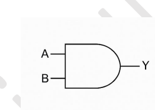
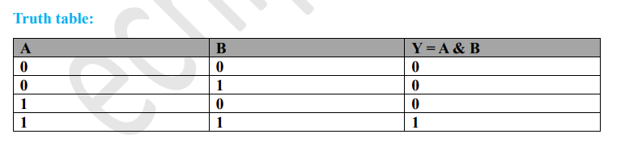
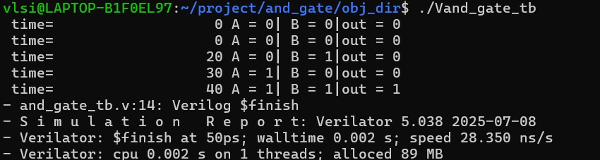
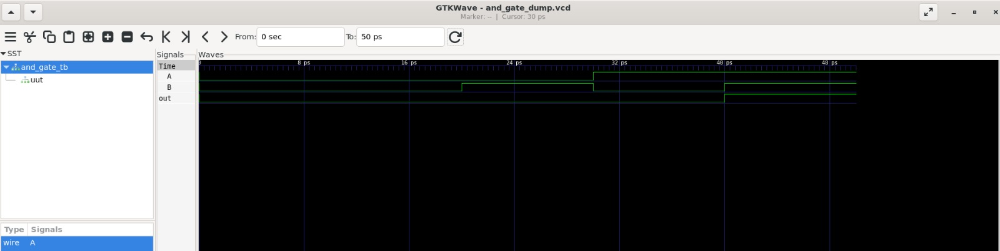

# Lab 01 – 2-Input AND Gate

## Aim

To design, simulate, and verify a 2-input AND gate using Verilog HDL with Verilator and visualize the waveform using GTKWave.

---

# Theory

An AND gate is a basic combinational logic gate that performs the logical AND operation.

The output becomes HIGH (1) only when all inputs are HIGH (1). Otherwise, the output remains LOW (0).

Boolean Expression:

\[
Y = A \& B
\]

---

# Block Diagram

<p align="center">

</p>

---

# Truth Table

<p align="center">

</p>

---

# Project Structure

```
Lab 01
│
├── Images
│   ├── block_diagram.png
│   ├── truth_table.png
│   ├── terminal_output.png
│   └── waveform.png
│
├── Source_Code
│   └── and_gate_design.v
│
├── Testbench
│   └── and_gate_tb.v
│
├── Waveforms
│   └── and_gate_dump.vcd
│
└── README.md
```

---

# RTL Design

The Verilog design file is available in:

```
Source_Code/and_gate_design.v
```

The module implements a 2-input AND gate using a continuous assignment statement.

---

# Testbench

The testbench is available in:

```
Testbench/and_gate_tb.v
```

The testbench verifies all possible input combinations:

| A | B | Output |
|:-:|:-:|:------:|
|0|0|0|
|0|1|0|
|1|0|0|
|1|1|1|

---

# Simulation

The project was simulated using **Verilator**.

Compilation command:

```bash
verilator --binary -j 0 -Wall and_gate_design.v and_gate_tb.v \
--top and_gate_tb --timing --CFLAGS "-std=c++20" --trace
```

Run the simulation:

```bash
./obj_dir/Vand_gate_tb
```

---

# Terminal Output

<p align="center">

</p>

The simulation verifies all four input combinations. The output becomes HIGH only when both inputs are HIGH.

---

# Waveform Output

<p align="center">

</p>

The GTKWave timing diagram confirms the correct functionality of the AND gate. The output changes according to the logical AND operation for every input transition.

---

# Generated Waveform File

The waveform generated during simulation is available in:

```
Waveforms/and_gate_dump.vcd
```

This VCD file can be opened using GTKWave for waveform analysis.

---

# Applications

- Digital Logic Design
- Arithmetic Logic Units (ALU)
- Control Circuits
- Multiplexers
- Decoders
- Embedded Systems
- FPGA and ASIC Design

---

# Result

The 2-input AND gate was successfully designed in Verilog HDL, simulated using Verilator, and verified using GTKWave. The observed simulation results matched the expected truth table, confirming the correct functionality of the design.
