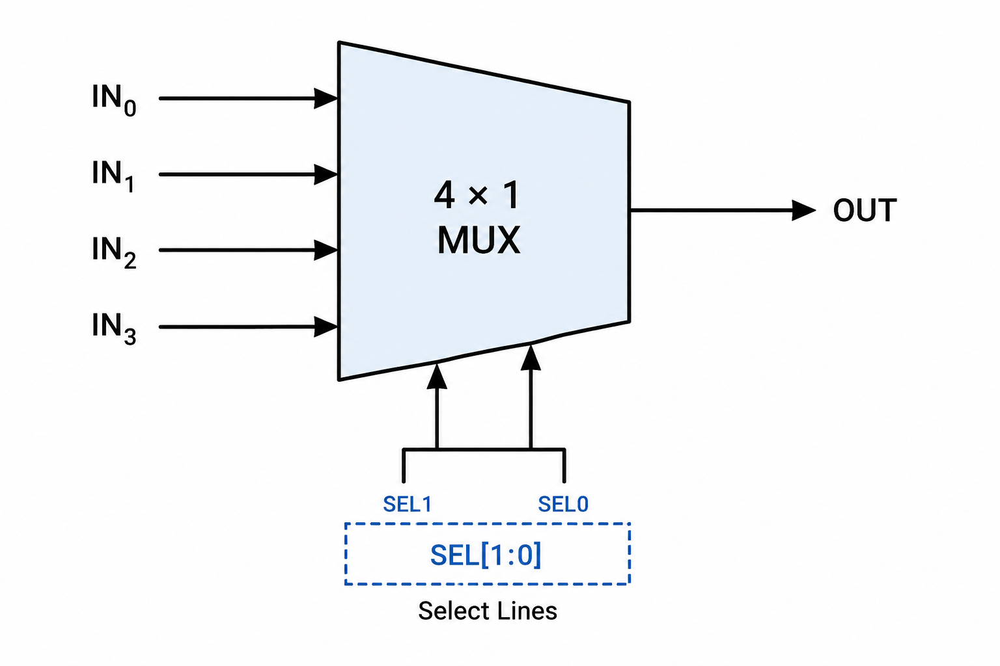
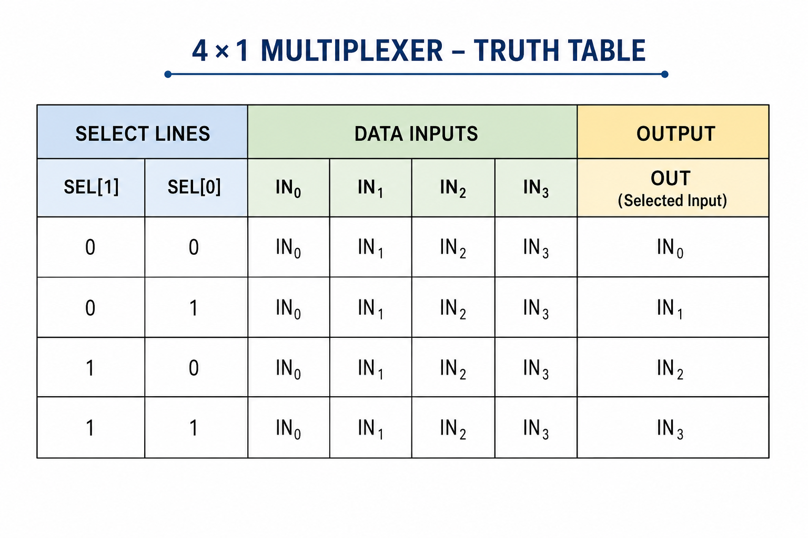
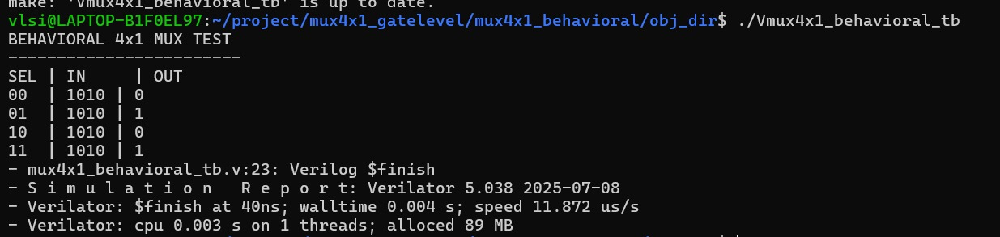
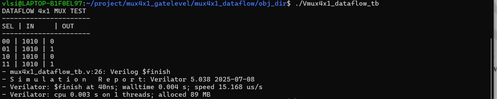
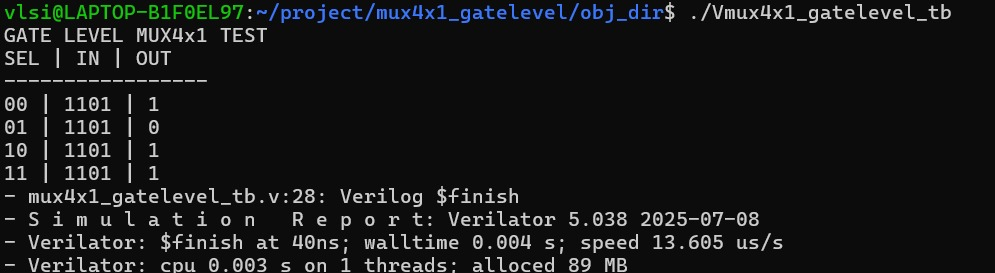
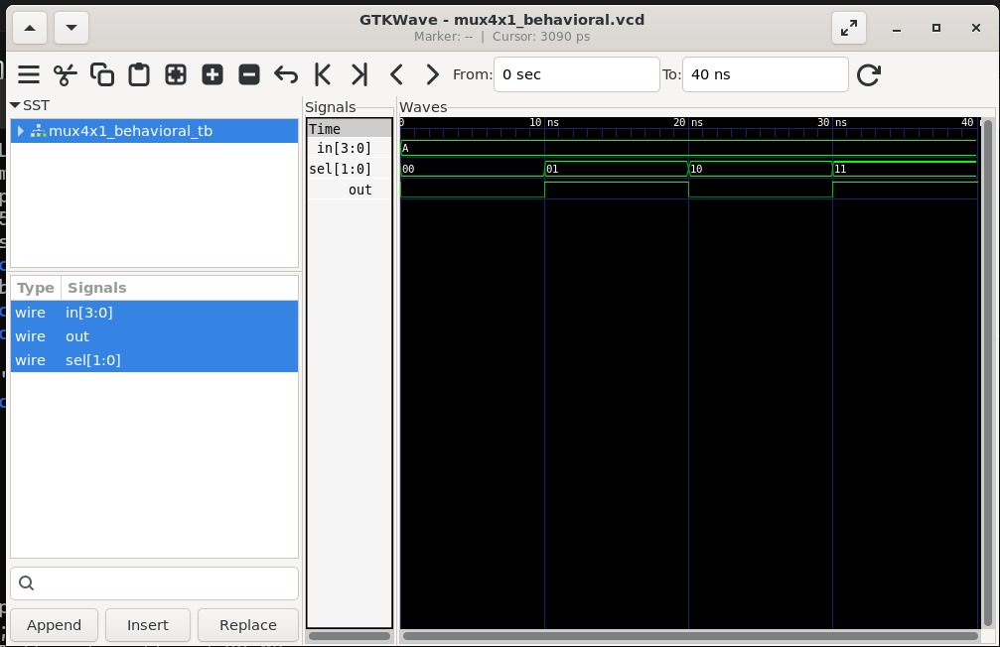
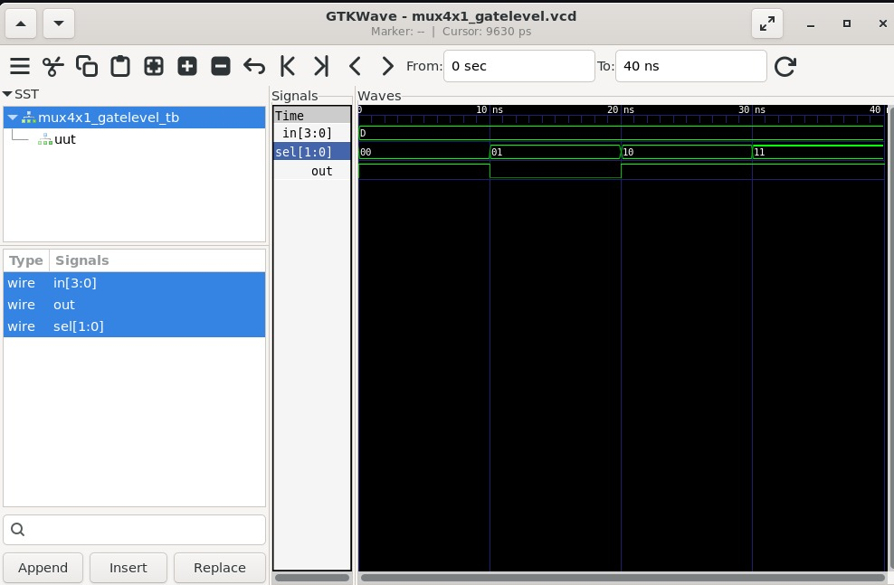

# Lab 02 – 4×1 Multiplexer

## Aim

To design, simulate, and verify a 4×1 Multiplexer using Verilog HDL in Behavioral, Dataflow, and Gate-Level modeling styles using Verilator and analyze the waveform using GTKWave.

---

# Theory

A 4×1 Multiplexer (MUX) is a combinational logic circuit that selects one of four input signals and forwards it to a single output based on two select lines.

The select inputs determine which input is connected to the output.

### Boolean Expression

```
Y = (~S1 & ~S0 & I0) |
    (~S1 &  S0 & I1) |
    ( S1 & ~S0 & I2) |
    ( S1 &  S0 & I3)
```

---

# Block Diagram

<p align="center">

</p>

---

# Truth Table

<p align="center">

</p>

---

# Project Structure

```text
Lab 02
│
├── Images
│   ├── behavioral_terminal.png
│   ├── behavioral_waveform.png
│   ├── dataflow_terminal.png
│   ├── dataflow_waveform.png
│   ├── gatelevel_terminal.png
│   ├── gatelevel_waveform.png
│   ├── block_diagram.png
│   └── truth_table.png
│
├── Source_Code
│   ├── mux4x1_behavioral.v
│   ├── mux4x1_dataflow.v
│   └── mux4x1_gatelevel.v
│
├── Testbench
│   ├── mux4x1_behavioral_tb.v
│   ├── mux4x1_dataflow_tb.v
│   └── mux4x1_gatelevel_tb.v
│
├── Waveforms
│   ├── mux4x1_behavioral.vcd
│   ├── mux4x1_dataflow.vcd
│   └── mux4x1_gatelevel.vcd
│
└── README.md
```

---

# RTL Design Files

The Verilog HDL source files are available in:

```
Source_Code/mux4x1_behavioral.v

Source_Code/mux4x1_dataflow.v

Source_Code/mux4x1_gatelevel.v
```

These files implement the 4×1 Multiplexer using three different Verilog modeling styles.

---

# Testbench Files

The corresponding testbench files are available in:

```
Testbench/mux4x1_behavioral_tb.v

Testbench/mux4x1_dataflow_tb.v

Testbench/mux4x1_gatelevel_tb.v
```

The testbenches verify the functionality of the multiplexer for all possible select-line combinations.

---

# Simulation Procedure

## Behavioral Modeling

### Compilation

```bash
verilator --binary -j 0 -Wall mux4x1_behavioral.v mux4x1_behavioral_tb.v \
--top mux4x1_behavioral_tb --timing --CFLAGS "-std=c++20" --trace
```

### Execution

```bash
./obj_dir/Vmux4x1_behavioral_tb
```

### Waveform Generation

```bash
gtkwave Waveforms/mux4x1_behavioral.vcd
```

or

```bash
gtkwave obj_dir/mux4x1_behavioral.vcd
```

---

## Dataflow Modeling

### Compilation

```bash
verilator --binary -j 0 -Wall mux4x1_dataflow.v mux4x1_dataflow_tb.v \
--top mux4x1_dataflow_tb --timing --CFLAGS "-std=c++20" --trace
```

### Execution

```bash
./obj_dir/Vmux4x1_dataflow_tb
```

### Waveform Generation

```bash
gtkwave Waveforms/mux4x1_dataflow.vcd
```

or

```bash
gtkwave obj_dir/mux4x1_dataflow.vcd
```

---

## Gate-Level Modeling

### Compilation

```bash
verilator --binary -j 0 -Wall mux4x1_gatelevel.v mux4x1_gatelevel_tb.v \
--top mux4x1_gatelevel_tb --timing --CFLAGS "-std=c++20" --trace
```

### Execution

```bash
./obj_dir/Vmux4x1_gatelevel_tb
```

### Waveform Generation

```bash
gtkwave Waveforms/mux4x1_gatelevel.vcd
```

or

```bash
gtkwave obj_dir/mux4x1_gatelevel.vcd
```

---

# Terminal Output

## Behavioral Modeling

<p align="center">

</p>

---

## Dataflow Modeling

<p align="center">

</p>

---

## Gate-Level Modeling

<p align="center">

</p>

---

# Waveform Output

## Behavioral Modeling

<p align="center">

</p>

---

## Dataflow Modeling

<p align="center">

</p>

---

## Gate-Level Modeling

<p align="center">

</p>

---

# Generated Waveform Files

The generated VCD files are available in:

```
Waveforms/mux4x1_behavioral.vcd

Waveforms/mux4x1_dataflow.vcd

Waveforms/mux4x1_gatelevel.vcd
```

These waveform files can be opened using GTKWave for timing analysis.

---

# Applications

- Data Selection Circuits
- Bus Routing
- Digital Communication Systems
- Arithmetic Logic Units (ALUs)
- FPGA Design
- ASIC Design
- Embedded Systems

---

# Result

The 4×1 Multiplexer was successfully designed and verified using Behavioral, Dataflow, and Gate-Level modeling styles in Verilog HDL. The designs were simulated using Verilator, and the generated waveforms were analyzed using GTKWave. The simulation results matched the expected multiplexer operation for all select-line combinations, confirming the correct functionality of the design.
