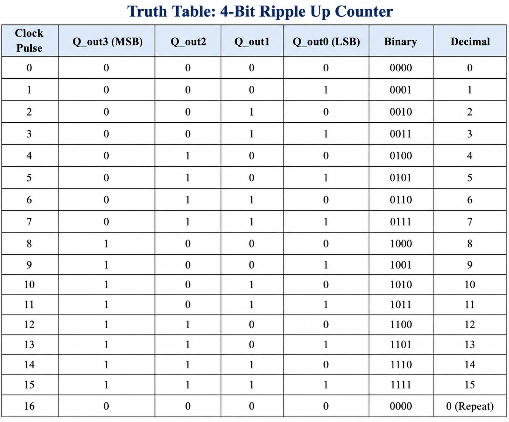

# Lab 07 – 4-Bit Ripple UP Counter

## Aim

To design, simulate, and verify a 4-bit Ripple UP Counter using Verilog HDL with Verilator and visualize the waveform using GTKWave.

---

# Theory

A 4-bit Ripple UP Counter is an asynchronous sequential circuit built using T Flip-Flops. It counts upward from **0000 (0)** to **1111 (15)** in binary.

The first flip-flop is driven directly by the clock, while each successive flip-flop is triggered by the output of the previous stage. Because the clock propagates through each flip-flop sequentially, this design is called a **Ripple Counter**.

After reaching **1111**, the counter wraps around to **0000** and repeats the counting sequence.

---

# Block Diagram

<p align="center">

</p>

---

# Truth Table

<p align="center">
 
</p>

---

# Project Structure

```text
Lab 07
│
├── Images
│   ├── block_diagram.png
│   ├── truth_table.png
│   ├── terminal_output.png
│   └── waveform.png
│
├── Source_Code
│   └── ripple_up_counter_4bit.v
│
├── Testbench
│   └── ripple_up_counter_4bit_tb.v
│
├── Waveforms
│   └── up_counter_dump.vcd
│
└── README.md
```

---

# RTL Design

The Verilog RTL source code is available in:

```text
Source_Code/ripple_up_counter_4bit.v
```

The design implements a **4-bit Ripple UP Counter** using four T Flip-Flops connected in cascade. The first flip-flop is driven by the external clock, while the remaining flip-flops receive the inverted output of the previous stage as their clock input.

---

# Testbench

The testbench is available in:

```text
Testbench/ripple_up_counter_4bit_tb.v
```

The testbench performs the following operations:

- Generates the clock signal.
- Applies asynchronous reset.
- Simulates the counter operation.
- Displays the count values.
- Generates the waveform (.vcd) file for GTKWave.

---

# Simulation

The project was simulated using **Verilator**.

Compilation command:

```bash
verilator --binary -j 0 -Wall ripple_up_counter_4bit.v ripple_up_counter_4bit_tb.v --top ripple_up_counter_tb --timing --CFLAGS "-std=c++20" --trace
```

Run the simulation:

```bash
cd obj_dir
make -f Vripple_up_counter_tb.mk Vripple_up_counter_tb
./Vripple_up_counter_tb
```

---

# Terminal Output

<p align="center">

</p>

The terminal output verifies the correct functionality of the Ripple UP Counter. After reset, the counter starts from **0000**, increments on every clock pulse, reaches **1111**, and then wraps back to **0000**, confirming proper asynchronous counting.

---

# Waveform Output

Generate the waveform using GTKWave:

```bash
gtkwave Waveforms/up_counter_dump.vcd
```

<p align="center">

</p>

The GTKWave timing diagram confirms that the Ripple UP Counter increments correctly from **0000** to **1111**. The waveform also shows the ripple effect, where each flip-flop changes state after the previous stage, demonstrating asynchronous counter operation.

---

# Generated Waveform File

The waveform generated during simulation is available in:

```text
Waveforms/up_counter_dump.vcd
```

This VCD file can be opened using GTKWave for timing analysis.

---

# Applications

- Digital Event Counters
- Frequency Division
- Digital Clocks
- Timer Circuits
- Sequence Generators
- FPGA and ASIC Designs
- Embedded Systems
- Control Systems

---

# Result

The **4-bit Ripple UP Counter** was successfully designed using Verilog HDL, simulated using Verilator, and verified using GTKWave. The counter correctly counted from **0000** to **1111** before repeating the sequence, confirming the expected asynchronous ripple counter operation.
