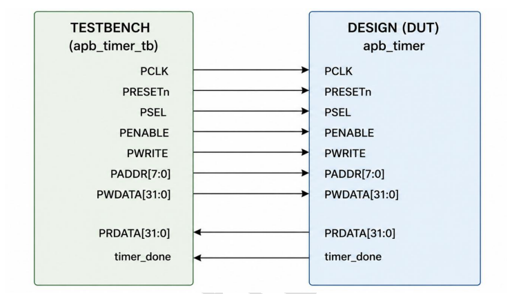
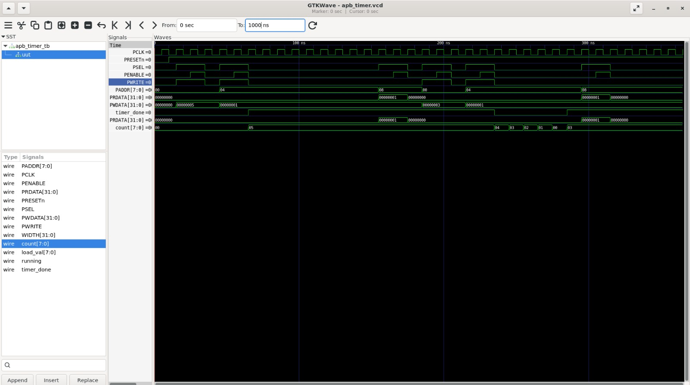

# Lab 09 – APB Timer

## Aim

To design, simulate, and verify an APB-based Timer peripheral using Verilog HDL with Verilator and analyze APB transactions using GTKWave.

---

# Theory

The Advanced Peripheral Bus (APB) is a low-power, low-bandwidth bus protocol that is part of the ARM AMBA family. It is widely used to interface simple peripherals such as timers, GPIOs, UARTs, watchdog timers, and other memory-mapped devices.

In this lab, an APB slave interface is implemented for a programmable countdown timer. The timer can be configured by writing a countdown value through APB registers, started or stopped using a control register, and monitored through a status register. The design demonstrates how APB transactions interact with peripheral logic through memory-mapped registers.

The APB interface operates in two phases:

- **Setup Phase** – The master asserts `PSEL`, places the address and control information on the bus, while `PENABLE` remains low.
- **Access Phase** – The master asserts `PENABLE`, completing the read or write transaction.

---

# Block Diagram

<p align="center">

</p>

---

# APB Register Map

| Address | Register | Description |
|----------|----------|-------------|
| 0x00 | Load Register | Stores the timer load value |
| 0x04 | Control Register | Bit 0 starts or stops the timer |
| 0x08 | Status Register | Bit 0 indicates timer completion (`timer_done`) |

---

# APB Transaction Flow

### Write Operation

1. Assert `PSEL`
2. Place address on `PADDR`
3. Place data on `PWDATA`
4. Set `PWRITE = 1`
5. Assert `PENABLE`
6. Data is written into the selected register

### Read Operation

1. Assert `PSEL`
2. Place address on `PADDR`
3. Set `PWRITE = 0`
4. Assert `PENABLE`
5. Peripheral places data on `PRDATA`

---

# Project Structure

```text
Lab 09
│
├── Images
│   ├── block_diagram.png
│   └── waveform.png
│
├── Scripts
│   └── run.sh
│
├── Source_Code
│   └── apb_timer.v
│
├── Testbench
│   └── apb_timer_tb.v
│
├── Waveforms
│   └── apb_timer.vcd
│
└── README.md
```

---

# RTL Design

The Verilog RTL implementation is available in:

```text
Source_Code/apb_timer.v
```

The design consists of:

- APB Slave Interface
- Address Decoder
- Load Register
- Control Register
- Status Register
- Countdown Timer
- Timer Done Logic

---

# Testbench

The testbench is available in:

```text
Testbench/apb_timer_tb.v
```

The testbench performs the following operations:

- Generates the APB clock.
- Applies active-low reset.
- Writes a countdown value to the Load Register.
- Starts the timer.
- Reads the Status Register.
- Repeats the process with another countdown value.
- Generates the waveform (`.vcd`) for timing analysis.

---

# Running the Simulation

A shell script is provided to automate the complete simulation flow.

The script performs the following operations:

- Compiles the RTL and testbench using Verilator.
- Builds the simulation executable.
- Executes the simulation.
- Opens the waveform in GTKWave.

The execution script is available in:

```text
Scripts/run.sh
```

Make the script executable:

```bash
chmod +x Scripts/run.sh
```

Run the simulation:

```bash
./Scripts/run.sh
```

---

# Waveform Output

<p align="center">

</p>

The waveform verifies:

- APB Setup Phase
- APB Access Phase
- Write Transactions
- Read Transactions
- Timer Load Operation
- Countdown Operation
- Assertion of `timer_done`
- Correct Register Readback through `PRDATA`

---

# Generated Waveform File

The waveform generated during simulation is available in:

```text
Waveforms/apb_timer.vcd
```

This VCD file can be viewed using GTKWave for detailed timing analysis.

---

# Applications

- Embedded Systems
- ARM AMBA-Based SoCs
- Timer Peripherals
- Memory-Mapped I/O Devices
- FPGA-Based Peripheral Design
- Microcontroller Systems
- Bus Interface Verification
- Digital System Design

---

# Result

The APB Timer was successfully designed in Verilog HDL, simulated using Verilator, and verified using GTKWave. The timer correctly accepted APB write transactions, loaded the programmed countdown value, performed the countdown operation, asserted the `timer_done` signal upon completion, and returned the correct register values during APB read transactions. The waveform confirmed proper APB protocol timing and successful integration of the timer peripheral with the APB bus interface.
