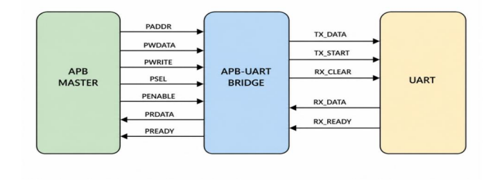
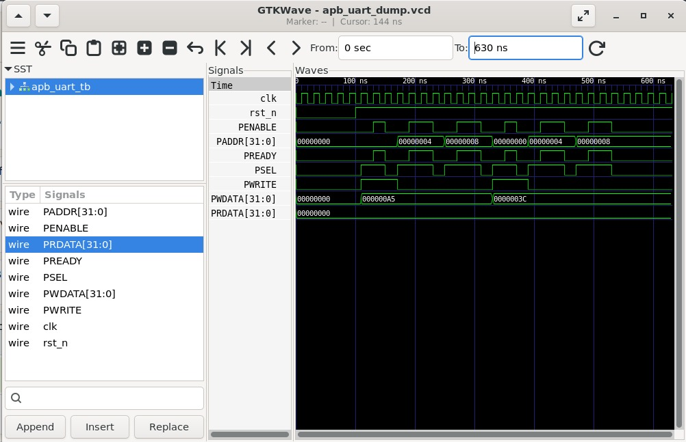

# Lab 10 – APB UART Interface

## Aim

To design, simulate, and verify an APB-to-UART Interface using Verilog HDL with Verilator and analyze APB transactions and UART data flow using GTKWave.

---

# Theory

The Advanced Peripheral Bus (APB) is a low-power peripheral bus used in ARM AMBA-based systems for connecting simple peripherals such as UARTs, GPIOs, Timers, SPI, and I2C modules.

In this lab, an APB-UART Interface is designed to demonstrate communication between an APB master and a UART peripheral through memory-mapped registers. The APB bridge receives read and write transactions from the APB master, translates them into UART register operations, and returns the corresponding data back to the processor.

Unlike a complete UART implementation with serial transmission timing, this design models UART communication using internal register transfers. Data written into the transmit register is internally forwarded to the receive register, allowing the complete APB communication flow to be verified without baud-rate generation.

---

# Block Diagram

<p align="center">

</p>

---

# Register Map

| Address | Access | Register | Description |
|----------|--------|----------|-------------|
| 0x00 | Write | TX Data Register | Writes transmit data to UART |
| 0x04 | Read | RX Data Register | Reads received UART data |
| 0x08 | Read | Status Register | Returns `{tx_busy, rx_ready}` |

---

# APB Communication Flow

### Write Transaction

1. APB master asserts `PSEL`.
2. Address is placed on `PADDR`.
3. Data is placed on `PWDATA`.
4. `PWRITE` is asserted.
5. `PENABLE` is asserted.
6. APB bridge forwards data to the UART transmit register.

### Read Transaction

1. APB master selects the peripheral.
2. Address is placed on `PADDR`.
3. `PWRITE` is deasserted.
4. APB bridge returns UART data on `PRDATA`.
5. `PREADY` completes the transaction.

---

# Project Structure

```text
Lab 10
│
├── Images
│   ├── block_diagram.png
│   └── waveform.png
│
├── Scripts
│   └── run.sh
│
├── Source_Code
│   ├── uart.v
│   ├── apb_uart_bridge.v
│   └── apb_uart_top.v
│
├── Testbench
│   └── apb_uart_tb.v
│
├── Waveforms
│   └── apb_uart_dump.vcd
│
└── README.md
```

---

# RTL Design

The RTL implementation is available in:

```text
Source_Code/
```

The design consists of the following modules:

- `uart.v`
- `apb_uart_bridge.v`
- `apb_uart_top.v`

The UART module models transmit and receive registers, while the APB-UART Bridge translates APB transactions into UART register operations. The top module integrates the complete APB-UART system.

---

# Testbench

The testbench is available in:

```text
Testbench/apb_uart_tb.v
```

The testbench performs the following operations:

- Generates a 50 MHz system clock.
- Applies active-low reset.
- Performs APB write transactions.
- Performs APB read transactions.
- Verifies UART register operation.
- Simulates two complete data transfers (`0xA5` and `0x3C`).
- Generates a VCD waveform for timing analysis.

---

# Running the Simulation

A shell script is provided to automate the complete simulation flow.

The script performs the following operations:

- Compiles the RTL and testbench using Verilator.
- Builds the simulation executable.
- Executes the simulation.
- Opens the waveform in GTKWave.

The execution script is available in:

```text
Scripts/run.sh
```

Make the script executable:

```bash
chmod +x Scripts/run.sh
```

Run the simulation:

```bash
./Scripts/run.sh
```

---

# Waveform Output

<p align="center">

</p>

The waveform verifies:

- APB Setup Phase
- APB Access Phase
- APB Read Transactions
- APB Write Transactions
- UART Register Access
- Data Transfer from TX Register to RX Register
- Correct Assertion of `PREADY`
- Proper Register Readback through `PRDATA`

---

# Generated Waveform File

The waveform generated during simulation is available in:

```text
Waveforms/apb_uart_dump.vcd
```

This VCD file can be viewed using GTKWave for detailed timing analysis.

---

# Applications

- ARM AMBA-Based SoCs
- Embedded Systems
- UART Peripheral Design
- Memory-Mapped I/O
- FPGA-Based Communication Systems
- APB Peripheral Verification
- Digital System Design
- Processor-to-Peripheral Communication

---

# Result

The APB-UART Interface was successfully designed in Verilog HDL, simulated using Verilator, and verified using GTKWave. The APB bridge correctly decoded read and write transactions, transferred data between the APB interface and UART registers, and returned the expected values through memory-mapped register access. The waveform verified proper APB protocol timing, UART register operation, and successful end-to-end communication between the APB master and UART peripheral.
