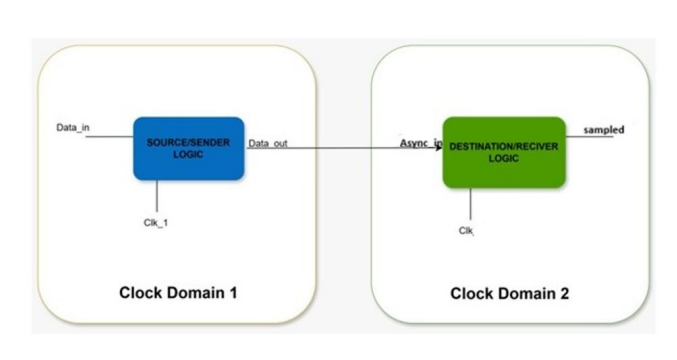
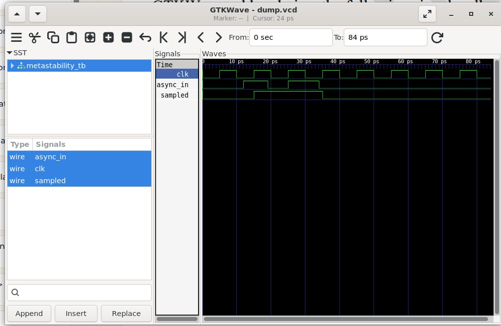

# Lab 11 – Demonstrating Metastability Without Synchronization

## Aim

To demonstrate the effect of metastability by directly sampling an asynchronous input without synchronization using Verilog HDL, Verilator, and GTKWave.

---

# Theory

Metastability is a condition that occurs when a flip-flop samples an asynchronous input whose transition occurs close to the active edge of the clock. Under these conditions, the flip-flop may temporarily enter an unstable state before resolving to a valid logic level.

Although digital simulators cannot accurately model the analog behavior of metastability, they can demonstrate the timing conditions that may lead to unreliable sampling. This experiment illustrates why asynchronous signals should never be sampled directly and highlights the importance of synchronizer circuits when crossing clock domains.

---

# Block Diagram

<p align="center">

</p>

---

# Working Principle

The design consists of a single D Flip-Flop that samples an asynchronous input signal directly.

- The asynchronous input changes independently of the system clock.
- The flip-flop samples the input on every rising edge of the clock.
- If the input changes very close to the sampling edge, the captured value may become unreliable.
- This demonstrates the possibility of metastability and timing violations in digital systems.

---

# Project Structure

```text
Lab 11
│
├── Images
│   ├── block_diagram.png
│   └── waveform.png
│
├── Scripts
│   └── run.sh
│
├── Source_Code
│   └── metastability.v
│
├── Testbench
│   └── metastability_tb.v
│
├── Waveforms
│   └── dump.vcd
│
└── README.md
```

---

# RTL Design

The RTL implementation is available in:

```text
Source_Code/metastability.v
```

The design contains a single flip-flop that directly samples an asynchronous input without any synchronization stages.

---

# Testbench

The testbench is available in:

```text
Testbench/metastability_tb.v
```

The testbench performs the following operations:

- Generates a periodic clock.
- Applies asynchronous input transitions intentionally close to the clock edge.
- Captures the sampled output.
- Generates a VCD waveform for timing analysis.

---

# Running the Simulation

A shell script is provided to automate the complete simulation flow.

The script performs the following operations:

- Compiles the RTL and testbench using Verilator.
- Builds the simulation executable.
- Executes the simulation.
- Opens the generated waveform in GTKWave.

The execution script is available in:

```text
Scripts/run.sh
```

Make the script executable:

```bash
chmod +x Scripts/run.sh
```

Run the simulation:

```bash
./Scripts/run.sh
```

---

# Waveform Output

<p align="center">

</p>

The waveform demonstrates:

- Regular clock generation.
- Asynchronous input transitions.
- Direct sampling of the asynchronous signal.
- Timing relationship between the clock and input signal.
- Possible unreliable sampling when the asynchronous input changes close to the clock edge.

---

# Generated Waveform File

The waveform generated during simulation is available in:

```text
Waveforms/dump.vcd
```

This VCD file can be opened using GTKWave for detailed timing analysis.

---

# Applications

- Clock Domain Crossing (CDC) Analysis
- Digital System Design
- FPGA Design
- ASIC Verification
- Synchronizer Design
- Embedded Systems
- High-Speed Digital Communication
- Reliability Analysis of Sequential Circuits

---

# Result

The metastability demonstration was successfully implemented using Verilog HDL and simulated with Verilator. The generated waveform illustrates how directly sampling an asynchronous input can lead to unreliable behavior when signal transitions occur near the active clock edge. This experiment highlights the importance of using synchronization techniques for safe clock-domain crossing in digital systems.
