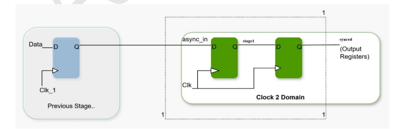
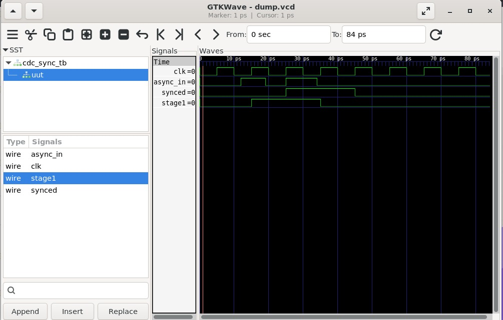

# Lab 12 – Fixing Metastability Using a 2-Stage Synchronizer

## Aim

To design and simulate a 2-stage synchronizer that safely transfers an asynchronous input signal into a synchronous clock domain, thereby reducing the probability of metastability using Verilog HDL, Verilator, and GTKWave.

---

# Theory

Metastability occurs when an asynchronous input is sampled very close to the active edge of a clock signal, causing a flip-flop to temporarily enter an unstable state. This unstable output can propagate through digital circuits, leading to incorrect system behavior.

A widely accepted solution to this problem is the use of a **2-stage synchronizer**, where two D flip-flops are connected in series and driven by the same clock. The first flip-flop samples the asynchronous signal, while the second flip-flop captures the stabilized output of the first stage. This greatly reduces the probability of metastability affecting the rest of the digital system.

---

# Block Diagram

<p align="center">

</p>

---

# Working Principle

The synchronizer consists of two D flip-flops connected in series.

- The asynchronous input is sampled by the first flip-flop.
- Any metastability generated at the first stage is allowed time to settle.
- The second flip-flop samples the stabilized output on the next clock edge.
- The synchronized output is therefore safe to use in the destination clock domain.
- The synchronization process introduces a delay of one clock cycle but significantly improves system reliability.

---

# Project Structure

```text
Lab 12
│
├── Images
│   ├── block_diagram.png
│   └── waveform.png
│
├── Scripts
│   └── run.sh
│
├── Source_Code
│   └── cdc_sync.v
│
├── Testbench
│   └── cdc_sync_tb.v
│
├── Waveforms
│   └── dump.vcd
│
└── README.md
```

---

# RTL Design

The RTL implementation is available in:

```text
Source_Code/cdc_sync.v
```

The design implements a **2-stage synchronizer** using two cascaded D flip-flops.

The first flip-flop samples the asynchronous input signal, while the second flip-flop provides a synchronized and stable output suitable for the receiving clock domain.

---

# Testbench

The testbench is available in:

```text
Testbench/cdc_sync_tb.v
```

The testbench performs the following operations:

- Generates a periodic clock signal.
- Applies asynchronous input transitions that are intentionally not aligned with the clock.
- Observes the synchronized output.
- Generates a VCD waveform for timing analysis.

---

# Running the Simulation

A shell script is provided to automate the complete simulation flow.

The script performs the following operations:

- Compiles the RTL and testbench using Verilator.
- Builds the simulation executable.
- Executes the simulation.
- Opens the generated waveform in GTKWave.

The execution script is available in:

```text
Scripts/run.sh
```

Make the script executable:

```bash
chmod +x Scripts/run.sh
```

Run the simulation:

```bash
./Scripts/run.sh
```

---

# Waveform Output

<p align="center">

</p>

The waveform demonstrates:

- Regular clock generation.
- Asynchronous input transitions.
- First-stage synchronization using the intermediate flip-flop.
- Stable synchronized output after one clock-cycle delay.
- Reliable clock-domain crossing without glitches.

---

# Generated Waveform File

The waveform generated during simulation is available in:

```text
Waveforms/dump.vcd
```

The waveform can be viewed using GTKWave to observe the synchronization process and verify proper operation of the 2-stage synchronizer.

---

# Applications

- Clock Domain Crossing (CDC)
- FPGA Design
- ASIC Design
- SoC Integration
- UART and SPI Interfaces
- Asynchronous Signal Synchronization
- Embedded Systems
- High-Speed Digital Systems
- Reliable Digital Communication

---

# Result

The 2-stage synchronizer was successfully implemented using Verilog HDL and simulated using Verilator. The generated waveform confirms that the asynchronous input is safely synchronized into the destination clock domain through two cascaded flip-flops. The synchronized output remains stable and free from glitches, demonstrating an effective solution for mitigating metastability and ensuring reliable clock-domain crossing in digital systems.
