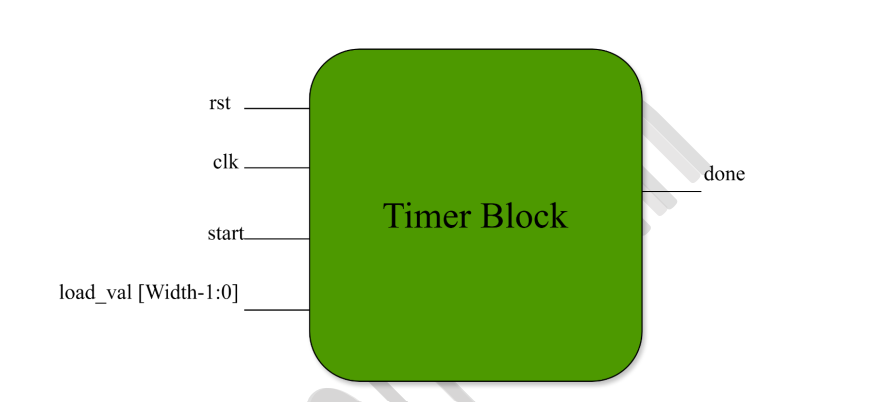
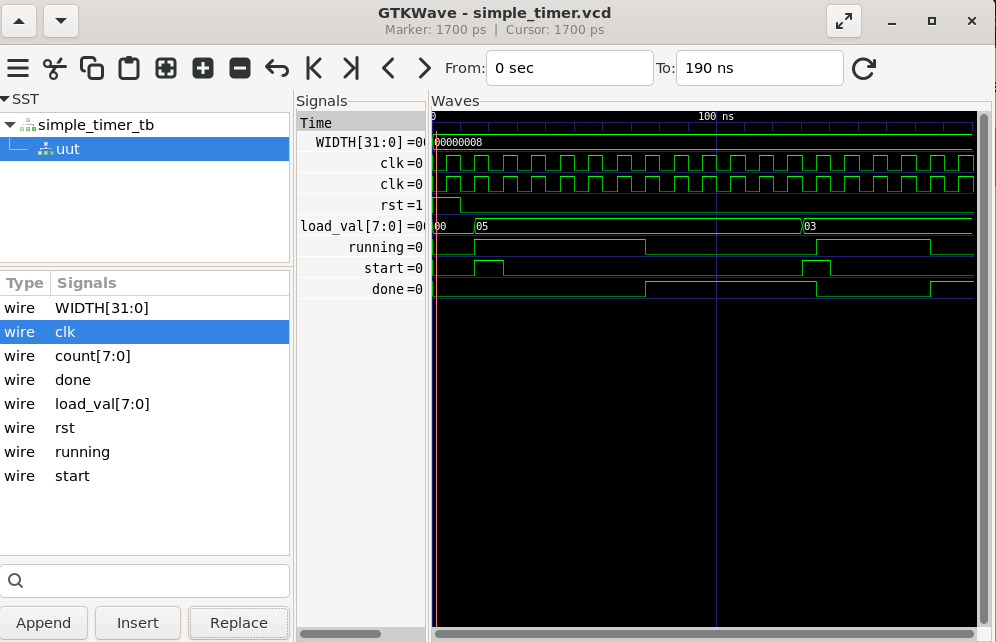

# Lab 15 – Implementation of Simple Timer IP

## Aim

To design, implement, and verify a parameterized countdown Timer IP using Verilog HDL. The timer is simulated using Verilator and analyzed using GTKWave to understand its operation and timing behavior.

---

# Theory

A Timer IP (Intellectual Property) is a fundamental building block used in digital systems to generate delays, schedule tasks, monitor timeouts, and provide timing control. A countdown timer starts from a user-defined value and decrements on every clock cycle until it reaches zero, where it asserts a completion signal.

The Timer IP implemented in this lab supports:

- Programmable countdown value
- Start control signal
- Synchronous reset
- Completion indication using a **done** signal

This experiment introduces the basics of timer-based hardware design and IP development methodology.

---

# Folder Structure

```text
Lab 15
│
├── Images
│   ├── block_diagram.png
│   └── waveform.png
│
├── Scripts
│   └── run.sh
│
├── Source_Code
│   └── simple_timer.v
│
├── Testbench
│   └── simple_timer_tb.v
│
├── Waveforms
│   └── simple_timer.vcd
│
└── README.md
```

---

# Block Diagram

<p align="center">

</p>

---

# Design Description

The Timer IP is implemented as a parameterized countdown timer.

The design consists of:

- **Clock Input (clk)** – Drives the timer operation.
- **Reset (rst)** – Initializes all internal registers.
- **Start Signal (start)** – Loads the timer and begins counting.
- **Load Value (load_val)** – Defines the initial countdown value.
- **Counter Register** – Stores the current timer count.
- **Running Flag** – Indicates whether the timer is active.
- **Done Signal** – Becomes high when the timer reaches zero.

The timer loads the programmed value when the **start** signal is asserted. Once started, the counter decrements on every clock cycle until it reaches zero, after which the timer stops and asserts the **done** signal.

---

# Output Waveform

<p align="center">

</p>

---

# Waveform Observation

The waveform verifies the correct functionality of the Timer IP.

- Reset initializes the timer.
- The **start** signal loads the preset value.
- The counter decrements on each rising edge of the clock.
- The **running** signal remains high while counting.
- The **done** signal is asserted once the counter reaches zero.
- The timer successfully performs multiple countdown operations with different load values.

---

# Tools Used

- Verilog HDL
- Verilator
- GTKWave
- GVim
- Ubuntu (WSL)

---

# Applications

- Embedded Systems
- FPGA Design
- ASIC Design
- Real-Time Operating Systems (RTOS)
- Watchdog Timers
- Communication Protocol Timeouts
- PWM Controllers
- Delay Generation
- Event Scheduling
- System Timing Control

---

# Learning Outcomes

After completing this lab, you will be able to:

- Design a parameterized Timer IP using Verilog HDL.
- Implement countdown timer logic using sequential circuits.
- Understand timer control using start and reset signals.
- Simulate RTL designs using Verilator.
- Analyze timer behavior using GTKWave.
- Understand the role of Timer IPs in embedded and SoC designs.

---

# Result

Successfully designed and implemented a parameterized Simple Timer IP using Verilog HDL. The simulation results verified correct timer initialization, countdown operation, and assertion of the **done** signal upon completion. GTKWave analysis confirmed the expected behavior of the Timer IP, demonstrating its suitability for timing control applications in FPGA, ASIC, and embedded system designs.
