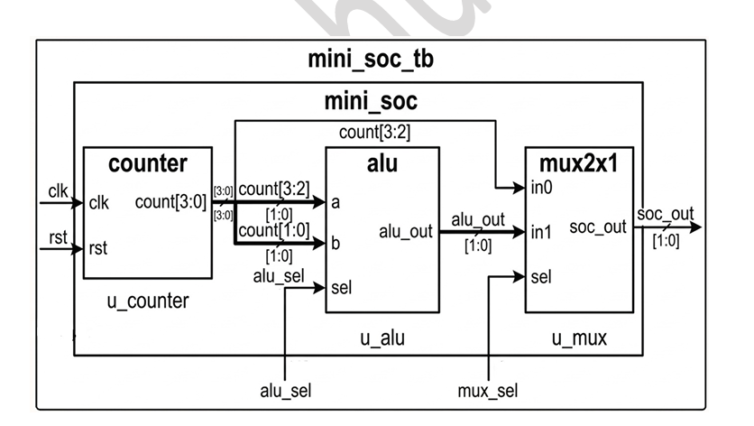
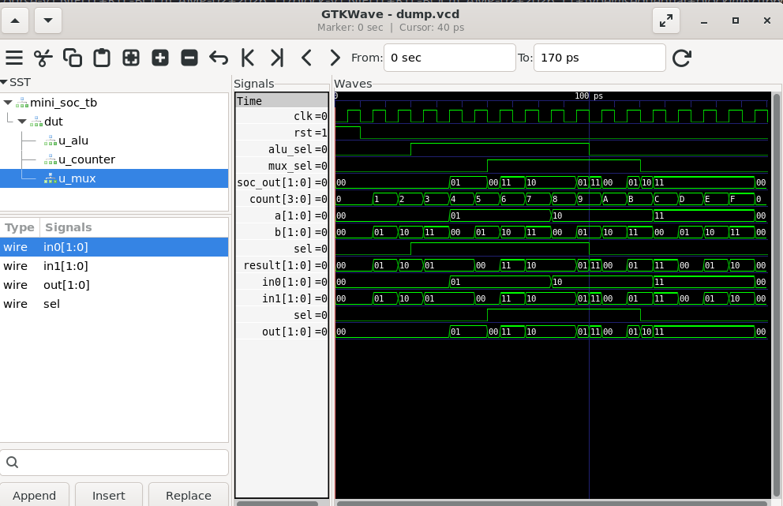

# Lab 16 – Integrating Multiple IPs into a Mini-SoC using Verilog

## Aim

To design, integrate, simulate, and verify a **Mini System-on-Chip (Mini-SoC)** by combining multiple reusable Verilog IP cores, including a **4-bit Counter**, **2-bit ALU**, and **2×1 Multiplexer**, using Verilator and GTKWave.

---

# Theory

A **System-on-Chip (SoC)** integrates multiple hardware modules or Intellectual Property (IP) cores into a single design to perform complex digital operations. Modular IP design enables reusability, easier verification, simplified maintenance, and faster development.

In this lab, three independent IP cores are designed and integrated into a top-level **Mini-SoC** module:

- A **4-bit Counter** generates sequential count values.
- A **2-bit ALU** performs addition or subtraction based on a control signal.
- A **2×1 Multiplexer** selects either the counter output or the ALU output.

The top-level Mini-SoC demonstrates how multiple reusable IP blocks communicate through internal signals and are controlled using external selection signals.

---

# Block Diagram

<p align="center">

</p>

---

# Applications

- System-on-Chip (SoC) Design
- FPGA Prototyping
- ASIC Design
- Embedded Systems
- Digital Signal Processing
- Processor Peripheral Integration
- Hardware IP Reuse
- Digital System Design Education

---

# Project Structure

```text
Lab 16
│
├── Images
│   ├── block_diagram.png
│   └── waveform.png
│
├── Scripts
│   └── run.sh
│
├── Source_Code
│   ├── counter.v
│   ├── alu.v
│   ├── mux2x1.v
│   └── mini_soc.v
│
├── Testbench
│   └── mini_soc_tb.v
│
├── Waveforms
│   └── dump.vcd
│
└── README.md
```

---

# RTL Design

The RTL design consists of four Verilog modules.

### **counter.v**

Implements a synchronous **4-bit up-counter** with reset. The counter increments on every positive edge of the clock after reset is released.

### **alu.v**

Implements a simple **2-bit Arithmetic Logic Unit (ALU)**.

Supported operations:

- Addition (`sel = 0`)
- Subtraction (`sel = 1`)

The ALU uses the upper two bits and lower two bits of the counter output as operands.

### **mux2x1.v**

Implements a **2-bit 2×1 Multiplexer**.

It selects between:

- Counter output
- ALU output

based on the **mux_sel** control signal.

### **mini_soc.v**

This is the top-level module that integrates all IP cores.

The Mini-SoC performs the following operations:

- Instantiates the Counter IP.
- Passes counter outputs to the ALU.
- Selects either the Counter output or ALU output through the Multiplexer.
- Produces the final system output on **soc_out**.

This demonstrates hierarchical RTL design and IP integration.

---

# Testbench

The testbench is available in:

```text
Testbench/mini_soc_tb.v
```

The testbench performs the following operations:

- Generates the system clock.
- Applies reset to initialize the Mini-SoC.
- Changes the **alu_sel** signal to switch between addition and subtraction.
- Changes the **mux_sel** signal to select different output sources.
- Dumps simulation data into **dump.vcd**.
- Verifies the interaction between all integrated IP modules.

This validates proper communication and functionality of the complete Mini-SoC.

---

# Running the Simulation

Execute the simulation using:

```bash
chmod +x Scripts/run.sh
./Scripts/run.sh
```

The script automatically:

- Compiles all RTL modules using Verilator.
- Builds the simulation executable.
- Executes the testbench.
- Generates the VCD waveform.
- Opens GTKWave for waveform analysis.

---

# Waveform Output

<p align="center">

</p>

### Waveform Observation

The waveform verifies the successful integration of all IP cores inside the Mini-SoC.

- **clk** provides the timing reference for all modules.
- **rst** initializes the counter before normal operation begins.
- The **count** signal increments continuously after reset is released.
- The ALU receives the upper and lower bits of the counter output as operands.
- **alu_sel** controls whether the ALU performs addition or subtraction.
- **alu_out** changes according to the selected arithmetic operation.
- **mux_sel** selects either the Counter output or the ALU output.
- The **soc_out** signal correctly reflects the selected output from the Multiplexer.
- The waveform demonstrates proper synchronization and communication between all integrated IP cores.

The simulation confirms successful hierarchical integration and signal routing within the Mini-SoC.

---

# Generated Waveform File

The generated VCD waveform file is available in:

```text
Waveforms/dump.vcd
```

This waveform file can be opened using GTKWave for timing analysis and functional verification.

---

# Applications

- FPGA-Based System Design
- SoC Prototyping
- ASIC Development
- Embedded Processor Systems
- Hardware IP Integration
- Digital Logic Verification
- RTL Design Education
- Modular Hardware Design

---

# Result

The **Mini System-on-Chip (Mini-SoC)** was successfully designed by integrating a **4-bit Counter**, **2-bit ALU**, and **2×1 Multiplexer** into a hierarchical top-level module using Verilog HDL. The design was simulated using Verilator and verified using GTKWave. The waveform confirmed correct counter operation, ALU functionality, multiplexer selection, and proper communication between all IP cores. This experiment demonstrates the principles of modular IP reuse, hierarchical hardware design, and system-level integration, providing a strong foundation for developing larger FPGA and ASIC-based SoC architectures.
