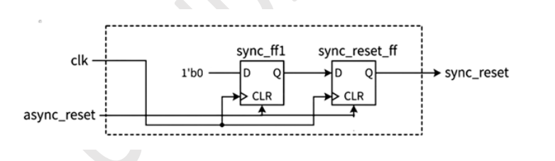
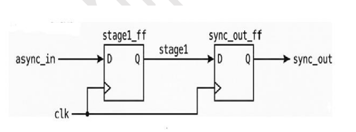
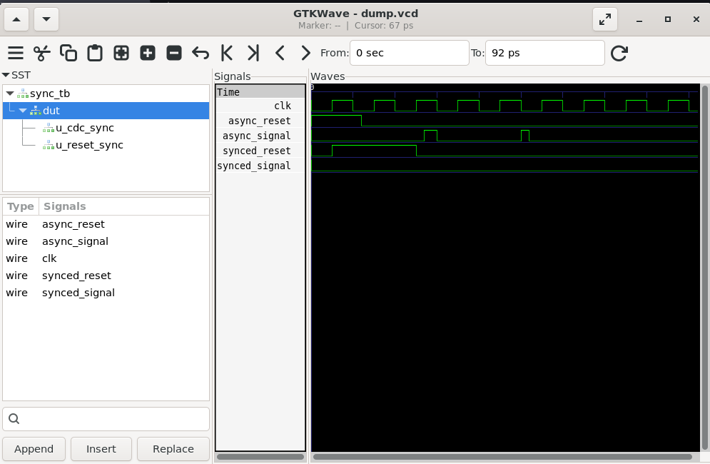

# Lab 17 – Inserting Clock and Reset Synchronization Logic

## Aim

To design, simulate, and verify **Clock Domain Crossing (CDC)** and **Reset Synchronization** logic using Verilog HDL, demonstrating how two-stage synchronizers eliminate glitches and reduce metastability when handling asynchronous reset and data signals.

---

# Theory

Modern digital systems often receive asynchronous signals from external devices or different clock domains. Sampling these signals directly may introduce **metastability**, causing unpredictable behavior and timing failures.

To improve system reliability, **two-stage synchronizers** are widely used.

This lab implements two important synchronizers:

- **Reset Synchronizer**
  - Converts an asynchronous reset into a clean synchronous reset.
  - Ensures reset deassertion occurs only on a clock edge.

- **CDC Synchronizer**
  - Synchronizes asynchronous data signals before they are used inside the destination clock domain.
  - Greatly reduces the probability of metastability.

Both synchronizers are integrated into a top-level module and verified using simulation.

---

# Block Diagram

## Reset Synchronizer

<p align="center">

</p>

## CDC Synchronizer

<p align="center">

</p>

---
# Project Structure

```text
Lab 17
│
├── Images
│   ├── reset_synchronizer.png
│   ├── cdc_synchronizer.png
│   └── waveform.png
│
├── Scripts
│   └── run.sh
│
├── Source_Code
│   ├── reset_sync.v
│   ├── cdc_sync.v
│   └── top_with_sync.v
│
├── Testbench
│   └── sync_tb.v
│
├── Waveforms
│   └── dump.vcd
│
└── README.md
```

---

# RTL Design

The design consists of three Verilog modules.

### **reset_sync.v**

Implements a two-stage reset synchronizer.

Features:

- Accepts an asynchronous reset input.
- Immediately asserts reset.
- Releases reset synchronously with the destination clock.
- Eliminates reset deassertion glitches.

---

### **cdc_sync.v**

Implements a two-stage Clock Domain Crossing synchronizer.

Features:

- Captures asynchronous input signals.
- Uses two flip-flops connected in series.
- Greatly reduces metastability.
- Produces a clean synchronized output.

---

### **top_with_sync.v**

Top-level integration module.

This module instantiates:

- Reset Synchronizer
- CDC Synchronizer

It combines both synchronizers into a single design, similar to synchronization logic used in real ASICs and SoCs.

---

# Testbench

The testbench is available in:

```text
Testbench/sync_tb.v
```

The testbench performs the following operations:

- Generates the system clock.
- Applies an asynchronous reset.
- Releases the reset at a non-clock-aligned instant.
- Generates asynchronous input pulses.
- Dumps waveform data into `dump.vcd`.
- Verifies the operation of both synchronizers.

This confirms that asynchronous reset and asynchronous input signals are safely synchronized into the destination clock domain.

---

# Running the Simulation

Execute the simulation using:

```bash
chmod +x Scripts/run.sh
./Scripts/run.sh
```

The script automatically:

- Compiles the RTL using Verilator.
- Builds the simulation executable.
- Executes the testbench.
- Generates the VCD waveform.
- Opens GTKWave.

---

# Waveform Output

<p align="center">

</p>

### Waveform Observation

The GTKWave simulation confirms the correct behavior of both synchronization circuits.

- **clk** acts as the destination clock.
- **async_reset** changes asynchronously and is not aligned with the clock.
- **synced_reset** is released only on a clock edge after passing through the reset synchronizer.
- **async_signal** generates short asynchronous pulses.
- **synced_signal** follows the asynchronous input after passing through the two-stage CDC synchronizer.
- The synchronized output remains stable and free from glitches.
- The simulation clearly demonstrates safe synchronization of asynchronous reset and data signals.

---

# Generated Waveform File

The generated VCD waveform file is available in:

```text
Waveforms/dump.vcd
```

This waveform file can be opened using GTKWave for timing analysis and functional verification.

---

# Key Concepts Demonstrated

| Concept | Description |
|----------|-------------|
| Asynchronous Reset | Reset signal that can change independently of the clock |
| Reset Synchronizer | Releases asynchronous reset safely into the clock domain |
| Clock Domain Crossing (CDC) | Transfer of signals between different clock domains |
| CDC Synchronizer | Two-stage flip-flop chain used to reduce metastability |
| Metastability | Temporary unstable state caused by asynchronous sampling |
| RTL Integration | Modular integration of synchronization IP blocks |

---

# Applications

- ASIC Design Flow
- FPGA Systems
- SoC Design
- Clock Domain Crossing
- Processor Reset Networks
- Embedded Controllers
- Communication Interfaces
- Digital System Reliability

---

# Result

The **Clock and Reset Synchronization Logic** was successfully implemented using Verilog HDL by integrating a **2-stage Reset Synchronizer** and a **2-stage CDC Synchronizer** into a top-level module. The design was simulated using Verilator and verified using GTKWave. The waveform confirmed that asynchronous reset signals were safely synchronized before deassertion and asynchronous data signals were reliably transferred into the destination clock domain without glitches. This experiment demonstrates the importance of synchronization techniques for preventing metastability and ensuring reliable operation in modern FPGA, ASIC, and SoC designs.
