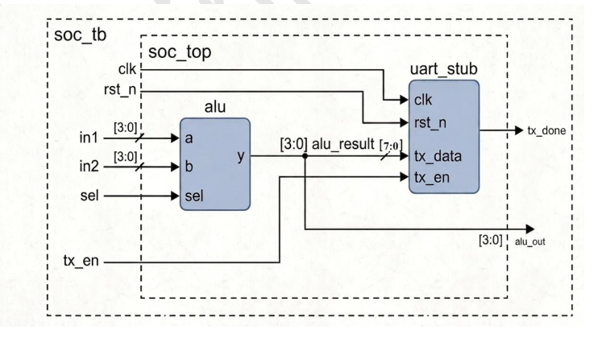
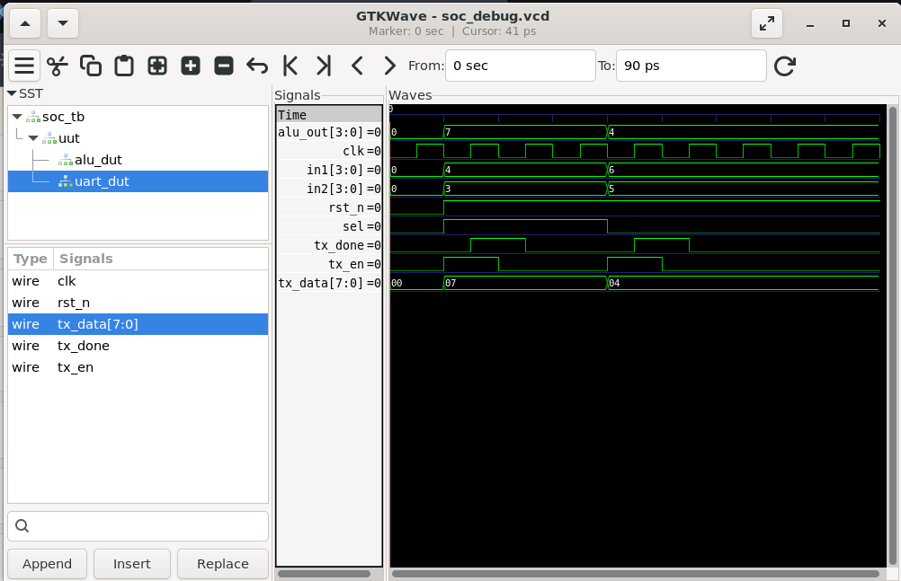

# Lab 18 – Debugging SoC Integration: Detecting a Real Bug

## Aim

To design, simulate, and debug a simple System-on-Chip (SoC) integration using Verilog HDL by identifying and resolving a signal width mismatch between an ALU and a UART module using Verilator and GTKWave.

---

# Theory

In modern SoC design, multiple Intellectual Property (IP) blocks are integrated to build complex digital systems. During integration, even small mistakes such as mismatched signal widths can introduce functional bugs that are difficult to detect without proper simulation and debugging.

This experiment demonstrates a common SoC integration issue where a **4-bit ALU output** is directly connected to an **8-bit UART transmit input**.

Incorrect connection:

```text
tx_data = alu_result
```

Correct connection:

```text
tx_data = {4'b0000, alu_result}
```

Zero-padding the upper four bits ensures proper data alignment and prevents undefined values during simulation.

This lab highlights the importance of waveform analysis and modular debugging during RTL integration.

---

# Block Diagram

<p align="center">

</p>

---

# Project Structure

```text
Lab 18
│
├── Images
│   ├── block_diagram.png
│   └── waveform.png
│
├── Scripts
│   └── run.sh
│
├── Source_Code
│   ├── alu.v
│   ├── uart_stub.v
│   └── soc_top.v
│
├── Testbench
│   └── soc_tb.v
│
├── Waveforms
│   └── soc_debug.vcd
│
└── README.md
```

---

# RTL Design

The design consists of three reusable IP modules integrated into a simple SoC.

### **alu.v**

Implements a simple 4-bit Arithmetic Logic Unit.

Features:

- Performs Bitwise AND operation
- Performs 4-bit Addition
- Operation selected using **sel**
- Generates a 4-bit ALU output

---

### **uart_stub.v**

Implements a simplified UART transmitter model.

Features:

- Accepts 8-bit transmit data
- Generates **tx_done** after transmission
- Used only for simulation and debugging

---

### **soc_top.v**

Top-level SoC integration module.

This module instantiates:

- 4-bit ALU
- UART Stub

The ALU output is connected to the UART transmit input.

**Intentional Bug**

The ALU generates a **4-bit output**, whereas the UART expects **8-bit transmit data**.

Incorrect connection:

```verilog
.tx_data(alu_result)
```

Correct implementation:

```verilog
.tx_data({4'b0000, alu_result})
```

This zero-padding fixes the width mismatch.

---

# Testbench

The testbench is available in:

```text
Testbench/soc_tb.v
```

The testbench performs the following operations:

- Generates the system clock.
- Applies reset.
- Performs ADD operation.
- Performs AND operation.
- Enables UART transmission.
- Dumps waveform data into `soc_debug.vcd`.
- Verifies ALU output and UART transmission.

The simulation intentionally exposes the width mismatch bug for debugging.

---

# Running the Simulation

Execute the simulation using:

```bash
chmod +x Scripts/run.sh
./Scripts/run.sh
```

The script automatically:

- Compiles the RTL using Verilator.
- Builds the simulation executable.
- Executes the testbench.
- Generates the VCD waveform.
- Opens GTKWave.

---

# Waveform Output

<p align="center">

</p>

### Waveform Observation

The GTKWave simulation demonstrates the behavior of the integrated SoC.

- **clk** drives all synchronous modules.
- **rst_n** initializes the SoC.
- **in1** and **in2** provide operands for the ALU.
- **sel** switches between AND and ADD operations.
- **alu_out** correctly displays the ALU computation.
- **tx_en** initiates UART transmission.
- **tx_done** becomes active after transmission.
- **tx_data** receives the ALU output.

During simulation, the width mismatch between the 4-bit ALU output and the 8-bit UART input becomes evident. In Verilator, the unused upper bits are automatically zero-padded because Verilator is a two-state simulator. However, in four-state simulators these upper bits may appear as **X (unknown)**, highlighting the importance of matching signal widths during IP integration.

---

# Generated Waveform File

The generated VCD waveform file is available in:

```text
Waveforms/soc_debug.vcd
```

This waveform file can be opened using GTKWave for functional verification and debugging.

---

# Debugging the Integration Bug

### Bug

The UART expects an **8-bit transmit input**, but the ALU generates only a **4-bit output**.

```verilog
.tx_data(alu_result)
```

---

### Fix

Pad the upper four bits with zeros before connecting the signal.

```verilog
.tx_data({4'b0000, alu_result})
```

---

### Benefit

- Proper signal width matching
- Eliminates unknown values
- Improves RTL portability
- Prevents synthesis and simulation mismatches

---

# Applications

- RTL Integration
- ASIC Verification
- FPGA Verification
- SoC Debugging
- IP Validation
- Digital Hardware Testing
- Embedded Systems
- VLSI Design Flow

---

# Result

The SoC integration was successfully implemented using Verilog HDL by integrating a 4-bit ALU and a UART Stub into a top-level module. The simulation was carried out using Verilator and verified using GTKWave. The experiment demonstrated how a simple signal width mismatch between interconnected IP blocks can introduce integration bugs. By identifying the issue through waveform analysis and correcting it using zero-padding, the design achieved proper signal alignment and reliable operation. This lab highlights the importance of careful IP integration, modular verification, and waveform-based debugging in modern ASIC, FPGA, and SoC design flows.
