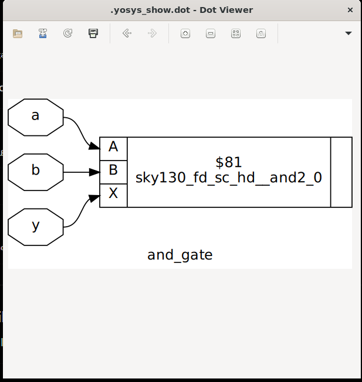
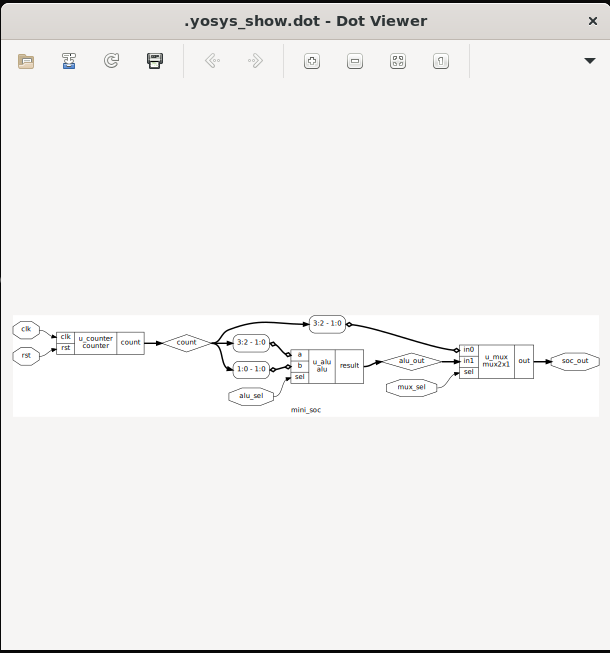

# Lab 20 – RTL Synthesis using Yosys and Sky130 Standard Cell Library

## Aim

To synthesize Verilog RTL designs using **Yosys**, perform technology mapping using the **Sky130 Standard Cell Library**, generate synthesized gate-level netlists, and visualize the synthesized circuits using Graphviz.

---

# Theory

RTL (Register Transfer Level) synthesis is the process of converting a behavioral Verilog HDL design into a gate-level implementation using logic gates available in a target technology library.

Yosys is an open-source synthesis tool widely used for FPGA and ASIC design flows. During synthesis, RTL descriptions are optimized, mapped to standard cells from a technology library, and exported as synthesized gate-level netlists.

The synthesis process typically involves:

- Reading the RTL design
- Checking the module hierarchy
- Optimizing the logic
- Technology mapping
- Generating a gate-level netlist
- Visualizing the synthesized design

Using the Sky130 Standard Cell Library enables ASIC-oriented synthesis based on real semiconductor standard cells.

---

# Synthesized AND Gate

<p align="center">

</p>

The synthesized AND gate is successfully mapped to the **Sky130 AND2 standard cell**, demonstrating technology mapping from RTL to standard-cell implementation.

---

# Synthesized Mini SoC

<p align="center">

</p>

The synthesized Mini SoC shows hierarchical integration of multiple IP blocks including the Counter, ALU, and Multiplexer after synthesis and technology mapping.

---

# Project Structure

```text
Lab 20
│
├── Images
│   ├── and_gate_synthesis.png
│   └── mini_soc_synthesis.png
│
├── Scripts
│   ├── and_gate.ys
│   └── mini_soc.ys
│
├── Source_Code
│   ├── and_gate.v
│   ├── counter.v
│   ├── alu.v
│   ├── mux2x1.v
│   └── mini_soc.v
│
├── Netlists
│   ├── and_gate_netlist.v
│   └── mini_soc_netlist.v
│
└── README.md
```

---

# RTL Design Files

The Verilog HDL source files are available in:

```text
Source_Code/
```

The designs include:

- AND Gate
- 4-bit Counter
- 2-bit ALU
- 2×1 Multiplexer
- Mini SoC Top Module

---

# Yosys Synthesis Scripts

The synthesis scripts are available in:

```text
Scripts/
```

These scripts automate:

- Reading RTL Verilog files
- Hierarchy checking
- RTL optimization
- Technology mapping
- Gate-level netlist generation
- Circuit visualization

---

# Synthesis Procedure

## Launch Yosys

```bash
yosys
```

---

## Run the Synthesis Script

For the AND Gate:

```bash
script Scripts/and_gate.ys
```

For the Mini SoC:

```bash
script Scripts/mini_soc.ys
```

---

## Manual Synthesis Commands (Example)

```bash
read_verilog Source_Code/and_gate.v

hierarchy -check -top and_gate

proc

opt

techmap

abc -liberty sky130_fd_sc_hd__tt_025C_1v80.lib

clean

write_verilog Netlists/and_gate_netlist.v

show
```

---

# Generated Netlists

The synthesized gate-level netlists are generated in:

```text
Netlists/
```

Generated files:

```text
and_gate_netlist.v

mini_soc_netlist.v
```

---

# Synthesis Output

### AND Gate

- RTL successfully synthesized using Yosys.
- Logic optimized and mapped to the **Sky130 AND2 standard cell**.
- Gate-level netlist generated successfully.

### Mini SoC

- Counter, ALU, and Multiplexer synthesized successfully.
- Module hierarchy preserved after synthesis.
- Technology mapping completed using Sky130 standard cells.
- Gate-level netlist generated successfully.

---

# Visualization

The synthesized circuits are visualized using **Graphviz** through the Yosys `show` command.

The generated diagrams verify:

- RTL hierarchy
- Module connectivity
- Standard-cell mapping
- Gate-level implementation

---

# Applications

- RTL Synthesis
- ASIC Design Flow
- Gate-Level Netlist Generation
- Digital Logic Optimization
- Open-Source VLSI Design
- Standard Cell Based Design
- SoC Integration

---

# Result

The RTL designs were successfully synthesized using **Yosys** and mapped to the **Sky130 Standard Cell Library**. Gate-level netlists were generated for both the **AND Gate** and the **Mini SoC**, and the synthesized hardware was successfully visualized using Graphviz. The experiment demonstrated the complete RTL-to-gate-level synthesis flow used in modern ASIC design and verified successful technology mapping using open-source EDA tools.
