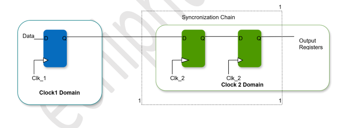
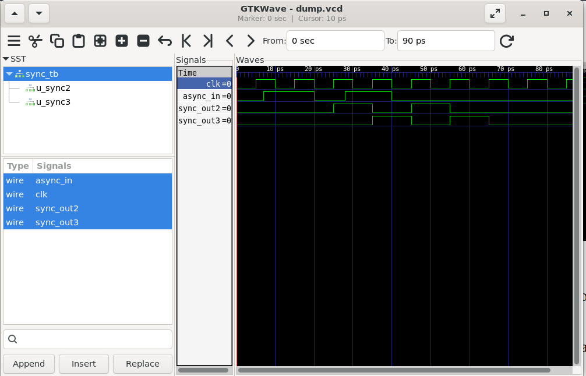

# Lab 22 – Multi-Stage Synchronizer for Stable Clock Domain Crossing (CDC)

## Aim

To design, simulate, and compare **2-stage** and **3-stage synchronizers** using Verilog HDL for safe Clock Domain Crossing (CDC), and to analyze their behavior using Verilator and GTKWave.

---

# Theory

Clock Domain Crossing (CDC) occurs when a signal generated in one clock domain is sampled in another clock domain. If the signal changes close to the sampling clock edge, the receiving flip-flop may enter a **metastable state**, resulting in unpredictable behavior.

A synchronizer minimizes this risk by passing the asynchronous signal through a chain of flip-flops clocked by the destination clock.

### 2-Stage Synchronizer

A 2-stage synchronizer consists of two cascaded D Flip-Flops.

- First flip-flop captures the asynchronous input.
- Second flip-flop provides a stable synchronized output.
- Commonly used in FPGA and ASIC designs.

### 3-Stage Synchronizer

A 3-stage synchronizer extends the synchronization chain by adding an additional flip-flop.

Advantages:

- Higher immunity to metastability
- Better reliability for safety-critical systems
- Slightly increased synchronization latency

---

# Block Diagram

<p align="center">

</p>

---

# Project Structure

```text
Lab 22
│
├── Images
│   ├── block_diagram.png
│   └── waveform.png
│
├── Scripts
│   └── run.sh
│
├── Source_Code
│   ├── sync2_stage.v
│   └── sync3_stage.v
│
├── Testbench
│   └── sync_tb.v
│
├── Waveforms
│   └── dump.vcd
│
└── README.md
```

---

# RTL Design

The RTL implementation consists of two synchronizer modules.

### sync2_stage.v

Implements a **2-stage synchronizer** using two cascaded D Flip-Flops.

Features:

- Captures asynchronous input
- Reduces metastability probability
- Provides synchronized output after two clock stages

---

### sync3_stage.v

Implements a **3-stage synchronizer** using three cascaded D Flip-Flops.

Features:

- Additional synchronization stage
- Higher metastability protection
- One additional clock-cycle latency
- Suitable for high-reliability digital systems

---

# Testbench

The testbench performs the following operations:

- Generates a periodic clock signal.
- Applies asynchronous input transitions at non-clock-aligned instants.
- Instantiates both 2-stage and 3-stage synchronizers.
- Records simulation activity into `dump.vcd`.
- Compares synchronization delay and output stability.

---

# Simulation Procedure

## Compilation

```bash
verilator --binary -j 0 -Wall sync2_stage.v sync3_stage.v sync_tb.v \
--top sync_tb --timing --CFLAGS "-std=c++20" --trace
```

---

## Execution

```bash
./obj_dir/Vsync_tb
```

---

## Waveform Generation

Open the generated waveform using GTKWave.

```bash
gtkwave Waveforms/dump.vcd
```

> If the VCD file is generated inside `obj_dir`, use:

```bash
gtkwave obj_dir/dump.vcd
```

---

# Waveform Output

<p align="center">

</p>

### Waveform Observation

The GTKWave simulation demonstrates the synchronization behavior of both synchronizers.

- **clk** is the destination clock driving both synchronizers.
- **async_in** changes asynchronously with respect to the clock.
- **sync_out2** follows the asynchronous input after passing through two flip-flops.
- **sync_out3** follows the input after three synchronization stages.
- The 3-stage synchronizer introduces an additional clock-cycle delay compared to the 2-stage synchronizer.
- Both synchronizers successfully eliminate direct asynchronous transitions from propagating into the destination clock domain.

The waveform clearly illustrates the trade-off between synchronization latency and metastability protection.

---

# Generated Waveform File

The generated VCD waveform file is available in:

```text
Waveforms/dump.vcd
```

This waveform can be viewed using GTKWave for detailed timing analysis.

---

# Applications

- Clock Domain Crossing (CDC)
- Multi-Clock FPGA Systems
- ASIC Design
- High-Speed Communication Interfaces
- Processor Subsystems
- Safety-Critical Digital Systems
- Aerospace and Automotive Electronics

---

# Result

The 2-stage and 3-stage synchronizers were successfully designed and verified using Verilog HDL. Simulation with Verilator and waveform analysis using GTKWave demonstrated reliable synchronization of asynchronous input signals. The 2-stage synchronizer provided efficient metastability mitigation with minimal latency, while the 3-stage synchronizer offered enhanced robustness at the cost of one additional clock cycle. This experiment highlights the importance of multi-stage synchronization techniques in ensuring reliable Clock Domain Crossing (CDC) in modern digital systems.
