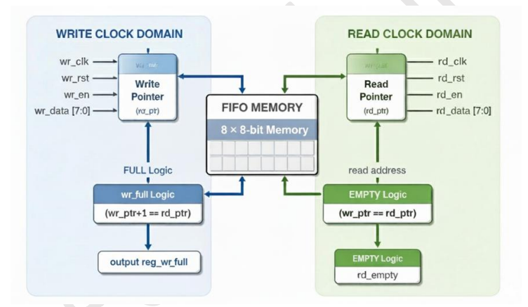
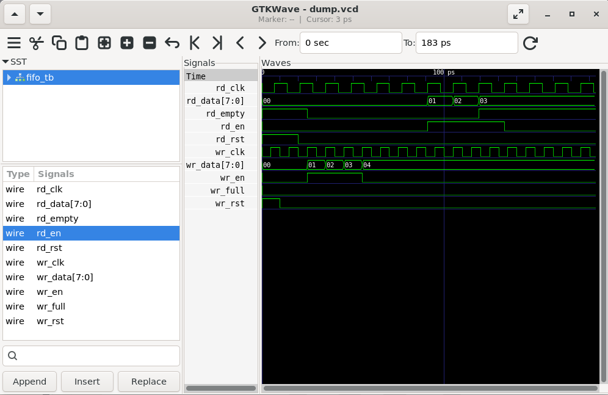

# Lab 23 – FIFO Design for Asynchronous Interfaces

## Aim

To design, simulate, and verify an **Asynchronous FIFO (First-In First-Out)** using Verilog HDL for reliable data transfer between independent clock domains, and to analyze its operation using Verilator and GTKWave.

---

# Theory

An **Asynchronous FIFO (First-In First-Out)** is a memory buffer used to safely transfer data between two different clock domains. Unlike synchronous FIFOs, the write and read operations are controlled by separate clocks, making asynchronous FIFOs essential for **Clock Domain Crossing (CDC)** applications.

The FIFO stores incoming data sequentially using a **write pointer** and retrieves data in the same order using a **read pointer**. To prevent overflow and underflow, the design uses **Full** and **Empty** status flags.

This type of FIFO is widely used in modern FPGA and ASIC designs where different hardware modules operate at independent clock frequencies.

---

# Block Diagram

<p align="center">

</p>

---

# Project Structure

```text
Lab 23
│
├── Images
│   ├── block_diagram.png
│   └── waveform.png
│
├── Scripts
│   └── run.sh
│
├── Source_Code
│   └── fifo.v
│
├── Testbench
│   └── fifo_tb.v
│
├── Waveforms
│   └── dump.vcd
│
└── README.md
```

---

# RTL Design

The RTL implementation consists of a simple asynchronous FIFO.

### fifo.v

The design includes:

- Independent write and read clock domains.
- 8-depth memory with 8-bit data width.
- Separate write and read pointers.
- Independent reset signals.
- Full and Empty status flags.
- Safe data transfer between asynchronous clock domains.

The FIFO stores incoming data using the write clock and retrieves the stored data using the read clock while preventing overflow and underflow conditions.

---

# Testbench

The testbench performs the following operations:

- Generates independent write and read clocks.
- Applies write and read reset signals.
- Writes multiple data values into the FIFO.
- Reads the stored data from the FIFO.
- Generates simulation waveforms.
- Verifies FIFO functionality under asynchronous clock conditions.

---

# Simulation Procedure

## Make the Script Executable

```bash
chmod +x Scripts/run.sh
```

---

## Run the Simulation

```bash
./Scripts/run.sh
```

The script automatically performs the following tasks:

- Compiles the RTL design using Verilator.
- Builds the simulation executable.
- Executes the testbench.
- Generates the `dump.vcd` waveform file.
- Opens the waveform in GTKWave.

---

# Waveform Output

<p align="center">

</p>

### Waveform Observation

The GTKWave simulation confirms the correct operation of the asynchronous FIFO.

- **wr_clk** drives write operations independently.
- **rd_clk** drives read operations using a different clock frequency.
- **wr_data** is written into FIFO memory whenever **wr_en** is asserted.
- **rd_data** retrieves the stored data when **rd_en** is enabled.
- **wr_full** prevents additional write operations when the FIFO becomes full.
- **rd_empty** indicates that no data is available for reading.
- Data written into the FIFO is successfully transferred to the read domain despite different clock frequencies.

The waveform demonstrates reliable communication between independent clock domains without data corruption, overflow, or underflow.

---

# Generated Waveform File

The generated VCD waveform file is available in:

```text
Waveforms/dump.vcd
```

This waveform file can be opened using GTKWave for detailed timing analysis.

---

# Applications

- Clock Domain Crossing (CDC)
- FIFO-Based Communication Systems
- UART Buffers
- DMA Controllers
- Embedded Systems
- FPGA Designs
- ASIC Designs
- High-Speed Digital Systems

---

# Result

The asynchronous FIFO was successfully designed using Verilog HDL and verified using Verilator. GTKWave waveform analysis confirmed reliable data transfer between independent write and read clock domains while correctly generating **Full** and **Empty** status flags. The simulation demonstrates how asynchronous FIFOs provide safe and efficient Clock Domain Crossing (CDC), making them fundamental building blocks in modern FPGA, ASIC, and SoC designs.
