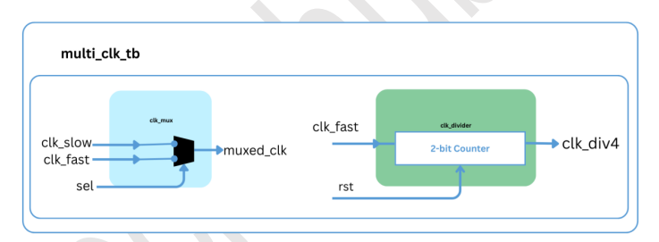
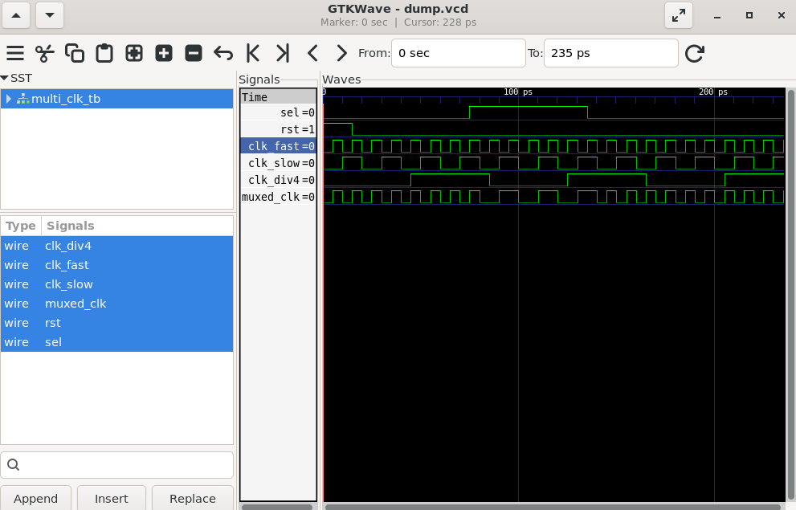

# Lab 24 – Multi-Clock Domain Architectures: Clock Multiplexers and Clock Dividers

## Aim

To design, simulate, and verify a **Clock Multiplexer** and a **Clock Divider** using Verilog HDL, demonstrating clock selection and frequency division in multi-clock domain architectures using Verilator and GTKWave.

---

# Theory

Modern digital systems and System-on-Chip (SoC) designs often require multiple clock domains operating at different frequencies. Managing these clock domains efficiently is essential for achieving high performance and reliable operation.

A **Clock Multiplexer (Clock MUX)** selects one of multiple clock sources based on a control signal, allowing dynamic switching between different clock domains.

A **Clock Divider** generates lower-frequency clocks from a high-speed input clock by dividing its frequency. Clock dividers are commonly used to provide slower clocks for peripherals, communication interfaces, timers, and control logic.

In this experiment, a simple clock multiplexer selects between two clock sources, while a divide-by-4 clock divider generates a slower clock using a 2-bit counter.

---

# Block Diagram

<p align="center">

</p>

---

# Project Structure

```text
Lab 24
│
├── Images
│   ├── block_diagram.png
│   └── waveform.png
│
├── Scripts
│   └── run.sh
│
├── Source_Code
│   ├── clk_mux.v
│   └── clk_divider.v
│
├── Testbench
│   └── multi_clk_tb.v
│
├── Waveforms
│   └── dump.vcd
│
└── README.md
```

---

# RTL Design

The RTL implementation consists of two independent modules.

### clk_mux.v

The clock multiplexer selects one of two clock inputs based on the select signal.

Features:

- Two clock inputs
- One clock output
- Select signal for clock switching
- Simple RTL implementation using continuous assignment

---

### clk_divider.v

The clock divider generates a lower-frequency clock from a high-speed input clock.

Features:

- Divide-by-4 clock generation
- 2-bit counter implementation
- Synchronous frequency reduction
- Reset support

---

# Testbench

The testbench performs the following operations:

- Generates two independent clocks with different frequencies.
- Applies reset to the clock divider.
- Switches between the two clock sources using the select signal.
- Records all simulation activity into the VCD waveform.
- Verifies clock multiplexing and frequency division.

---

# Simulation Procedure

## Make the Script Executable

```bash
chmod +x Scripts/run.sh
```

---

## Run the Simulation

```bash
./Scripts/run.sh
```

The script automatically performs the following tasks:

- Compiles the RTL design using Verilator.
- Builds the simulation executable.
- Executes the testbench.
- Generates the `dump.vcd` waveform file.
- Opens the waveform using GTKWave.

---

# Waveform Output

<p align="center">

</p>

### Waveform Observation

The GTKWave simulation demonstrates the behavior of both the Clock Multiplexer and Clock Divider.

- **clk_fast** operates at a higher frequency.
- **clk_slow** operates at a lower frequency.
- **clk_div4** is generated by dividing the fast clock using a 2-bit counter.
- **muxed_clk** switches between the fast and slow clocks based on the value of the **sel** signal.
- During reset, the clock divider initializes its counter and output.
- The divided clock toggles at one-fourth the frequency of the input clock, confirming correct frequency division.
- The waveform clearly illustrates clock switching and multiple clock domain operation.

---

# Generated Waveform File

The generated VCD waveform file is available in:

```text
Waveforms/dump.vcd
```

This waveform file can be opened using GTKWave for detailed timing analysis.

---

# Applications

- Multi-Clock Domain Systems
- Clock Generation Circuits
- FPGA Designs
- ASIC Designs
- Embedded Controllers
- Communication Systems
- Processor Clock Management
- System-on-Chip (SoC)

---

# Result

The Clock Multiplexer and Clock Divider were successfully designed using Verilog HDL and verified using Verilator. GTKWave waveform analysis confirmed correct clock selection between multiple clock sources and successful divide-by-4 clock generation. The experiment demonstrates fundamental clock management techniques widely used in modern FPGA, ASIC, and SoC designs involving multiple clock domains.
