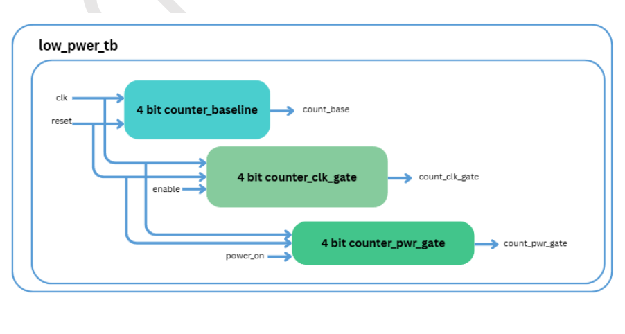
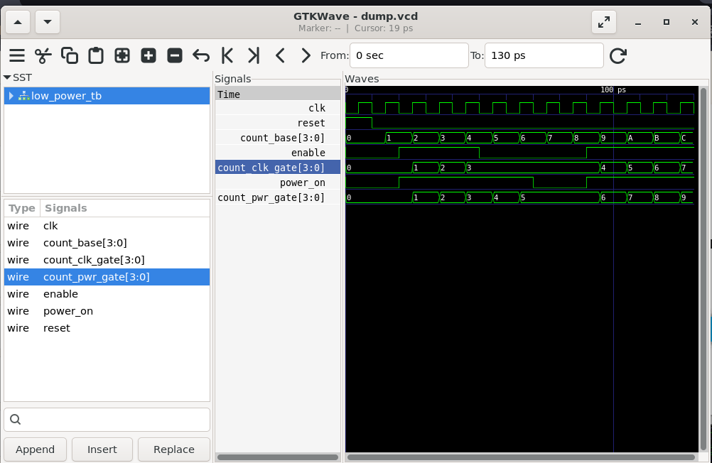

# Lab 25 – Demonstrating Clock Gating and Power Gating for Low-Power SoC Design

## Aim

To design, simulate, and compare baseline, clock-gated, and power-gated counters using Verilog HDL, demonstrating how clock gating reduces dynamic power consumption and power gating minimizes leakage power in low-power SoC designs using Verilator and GTKWave.

---

# Theory

Power optimization is one of the most important aspects of modern ASIC and SoC design. As semiconductor technology scales, reducing both dynamic and static power consumption becomes essential for improving battery life, thermal performance, and overall system efficiency.

**Clock Gating** reduces dynamic power by disabling the clock signal to inactive logic blocks, thereby minimizing unnecessary switching activity.

**Power Gating** reduces leakage power by completely turning off inactive circuit blocks. In RTL simulation, this behavior is modeled by preventing logic updates whenever the power control signal is disabled.

The experiment compares three different counter implementations:

- **Baseline Counter** – Always active and increments every clock cycle.
- **Clock-Gated Counter** – Updates only when the enable signal is asserted.
- **Power-Gated Counter** – Operates only when the power signal is enabled, otherwise retains its previous value.

---

# Block Diagram

<p align="center">

</p>

---

# Project Structure

```text
Lab 25
│
├── Images
│   ├── block_diagram.png
│   └── waveform.png
│
├── Scripts
│   └── run.sh
│
├── Source_Code
│   ├── counter_baseline.v
│   ├── counter_clk_gate.v
│   └── counter_pwr_gate.v
│
├── Testbench
│   └── low_power_tb.v
│
├── Waveforms
│   └── dump.vcd
│
└── README.md
```

---

# RTL Design

The RTL implementation consists of three different counter architectures.

### counter_baseline.v

Implements a standard 4-bit synchronous counter.

Features:

- Increments on every clock edge.
- No power-saving mechanism.
- Represents conventional sequential logic.

---

### counter_clk_gate.v

Implements a clock-gated counter.

Features:

- Uses an enable signal as a clock gating control.
- Counter updates only when **enable = 1**.
- Reduces unnecessary switching activity during idle periods.

---

### counter_pwr_gate.v

Implements a simulated power-gated counter.

Features:

- Uses a **power_on** control signal.
- Counter updates only when powered.
- Retains its previous value when power is disabled.
- Demonstrates RTL-level power gating behavior.

---

# Testbench

The testbench performs the following operations:

- Generates the system clock.
- Applies reset at the beginning of the simulation.
- Enables and disables clock gating.
- Enables and disables simulated power gating.
- Compares the behavior of all three counters.
- Records simulation activity into the VCD waveform file.

---

# Simulation Procedure

## Make the Script Executable

```bash
chmod +x Scripts/run.sh
```

---

## Run the Simulation

```bash
./Scripts/run.sh
```

The script automatically performs the following tasks:

- Compiles the RTL design using Verilator.
- Builds the simulation executable.
- Executes the testbench.
- Generates the `dump.vcd` waveform.
- Opens GTKWave for waveform visualization.

---

# Waveform Output

<p align="center">

</p>

### Waveform Observation

The GTKWave simulation clearly demonstrates the behavior of the three counter implementations.

- **count_base** increments continuously on every clock edge throughout the simulation.
- **count_clk_gate** increments only when the **enable** signal is asserted and pauses whenever the enable signal becomes low.
- **count_pwr_gate** updates only while **power_on** is high and freezes its current value when power is disabled.
- The waveform illustrates how clock gating suppresses unnecessary switching activity, while power gating completely halts circuit operation during inactive periods.
- Comparing the three counters highlights the effectiveness of both low-power design techniques.

---

# Generated Waveform File

The generated VCD waveform file is available in:

```text
Waveforms/dump.vcd
```

This waveform file can be opened using GTKWave for detailed timing and functional analysis.

---

# Applications

- Low-Power ASIC Design
- SoC Power Optimization
- Embedded Systems
- IoT Devices
- Mobile Electronics
- Battery-Powered Applications
- Digital Power Management
- Energy-Efficient Digital Systems

---

# Result

The baseline, clock-gated, and power-gated counters were successfully designed using Verilog HDL and verified using Verilator. GTKWave waveform analysis confirmed that the baseline counter continuously toggles, the clock-gated counter updates only when enabled, and the power-gated counter freezes during power-off periods. The experiment demonstrates the effectiveness of clock gating in reducing dynamic power consumption and power gating in minimizing leakage power, which are fundamental techniques in modern low-power ASIC and SoC design.
