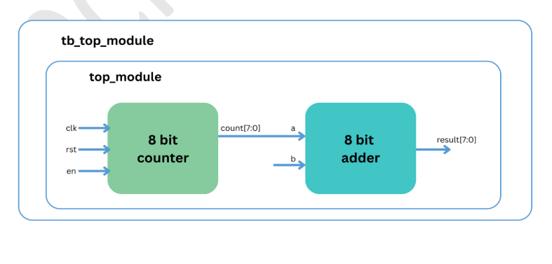
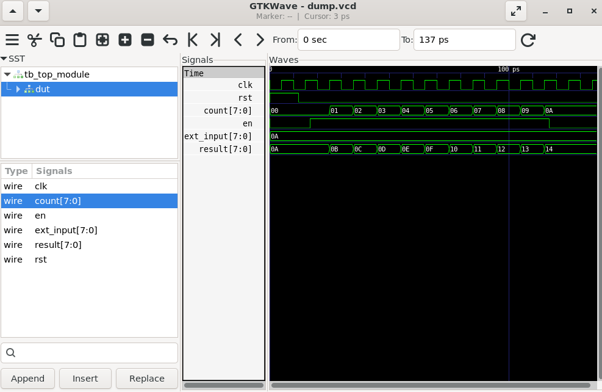

# Lab 26 – Understanding Hierarchical Design and IP Reuse Strategies

## Aim

To design, simulate, and verify a hierarchical RTL design using reusable parameterized IP blocks in Verilog HDL, demonstrating modular design methodology and IP reuse through Verilator and GTKWave.

---

# Theory

Hierarchical design is a fundamental methodology in digital system design that divides a complex system into smaller, reusable modules. Instead of designing an entire system as a single block, independent IP (Intellectual Property) modules are created, verified, and then integrated into higher-level designs.

IP reuse significantly reduces development time, improves maintainability, and enables scalable System-on-Chip (SoC) development. Parameterized modules further enhance flexibility by allowing the same design to be reused with different configurations such as varying data widths.

In this experiment, a reusable parameterized **8-bit Counter** and **8-bit Adder** are instantiated inside a top-level module. The counter continuously generates data, which is added to an external input through the reusable adder IP, demonstrating hierarchical integration and modular RTL design.

---

# Block Diagram

<p align="center">

</p>

---

# Project Structure

```text
Lab 26
│
├── Images
│   ├── block_diagram.png
│   └── waveform.png
│
├── Scripts
│   └── run.sh
│
├── Source_Code
│   ├── adder.v
│   ├── counter.v
│   └── top_module.v
│
├── Testbench
│   └── tb_top_module.v
│
├── Waveforms
│   └── dump.vcd
│
└── README.md
```

---

# RTL Design

The RTL implementation consists of three reusable modules.

### adder.v

Implements a parameterized combinational adder.

Features:

- Parameterized data width
- Performs arithmetic addition
- Reusable arithmetic IP block
- Pure combinational logic

---

### counter.v

Implements a parameterized synchronous up-counter.

Features:

- Parameterized counter width
- Enable-controlled counting
- Reset support
- Sequential logic implementation

---

### top_module.v

Integrates the reusable counter and adder IPs into a hierarchical design.

Features:

- Instantiates both reusable IP blocks
- Connects counter output to the adder input
- Adds an external input to the counter value
- Demonstrates modular RTL integration

---

# Testbench

The testbench performs the following operations:

- Generates a 10 ns system clock.
- Applies an initial reset.
- Enables the counter after reset.
- Provides an external 8-bit input to the adder.
- Monitors the integrated module outputs.
- Dumps simulation activity into the VCD waveform file.

---

# Simulation Procedure

## Make the Script Executable

```bash
chmod +x Scripts/run.sh
```

---

## Run the Simulation

```bash
./Scripts/run.sh
```

The script automatically performs the following tasks:

- Compiles the RTL design using Verilator.
- Builds the simulation executable.
- Executes the testbench.
- Generates the `dump.vcd` waveform file.
- Opens GTKWave for waveform visualization.

---

# Waveform Output

<p align="center">

</p>

### Waveform Observation

The GTKWave simulation demonstrates the interaction between the reusable IP blocks.

- The **clk** signal drives the entire hierarchical design.
- The **rst** signal initializes the counter before normal operation begins.
- When **en** becomes high, the counter increments on every rising clock edge.
- **count** increases sequentially throughout the simulation.
- **ext_input** remains constant and is continuously applied to the adder.
- **result** always represents the sum of the current counter value and the external input.
- The waveform clearly illustrates successful hierarchical integration and correct communication between reusable IP modules.

---

# Generated Waveform File

The generated VCD waveform file is available in:

```text
Waveforms/dump.vcd
```

This waveform file can be opened using GTKWave for detailed timing and functional analysis.

---

# Applications

- Reusable RTL IP Development
- Hierarchical ASIC Design
- FPGA Prototyping
- SoC Integration
- Embedded Processor Design
- Digital Hardware Development
- Modular System Design
- Parameterized Hardware Libraries

---

# Result

The parameterized Counter and Adder IP blocks were successfully designed, integrated, and verified using Verilog HDL. Simulation using Verilator and waveform analysis in GTKWave confirmed the correct hierarchical interaction between the reusable modules. The experiment demonstrates the advantages of hierarchical RTL design and IP reuse, providing a scalable and maintainable approach for modern FPGA, ASIC, and System-on-Chip (SoC) development.
