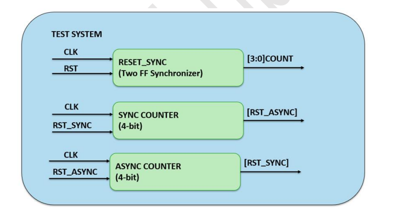
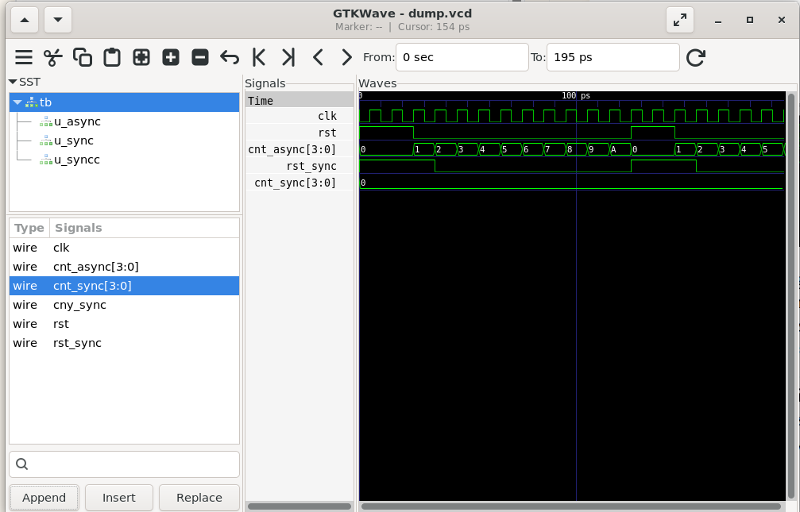

# Lab 27 – Global Reset vs Synchronized Reset Release

## Aim

To design, simulate, and compare asynchronous reset and synchronized reset release techniques using Verilog HDL, demonstrating how synchronized reset eliminates timing hazards and ensures reliable startup in digital systems using Verilator and GTKWave.

---

# Theory

Reset circuitry is one of the most critical components of digital system design. Every sequential circuit requires a reliable mechanism to initialize registers before normal operation begins. While asynchronous resets provide immediate initialization, improper reset release may introduce metastability and timing hazards.

An **Asynchronous Reset** immediately resets all flip-flops regardless of the system clock. Although reset assertion is safe, releasing the reset asynchronously can cause different flip-flops to leave the reset state at slightly different times.

A **Synchronized Reset Release** overcomes this problem by passing the asynchronous reset through a two-stage synchronizer. The reset is still asserted immediately, but its deassertion is aligned with the system clock, ensuring that all sequential elements begin operation simultaneously.

This experiment compares the behavior of an asynchronous counter and a synchronized counter during reset assertion and release.

---

# Block Diagram

<p align="center">

</p>

---

# Project Structure

```text
Lab 27
│
├── Images
│   ├── block_diagram.png
│   └── waveform.png
│
├── Scripts
│   └── run.sh
│
├── Source_Code
│   ├── counter_async.v
│   ├── reset_sync.v
│   └── counter_sync.v
│
├── Testbench
│   └── tb.v
│
├── Waveforms
│   └── dump.vcd
│
└── README.md
```

---

# RTL Design

The RTL implementation consists of three independent modules.

### counter_async.v

Implements a 4-bit counter with an asynchronous reset.

Features:

- Immediate reset assertion
- Counter increments on every clock edge
- Reset is independent of the clock
- Demonstrates global asynchronous reset behavior

---

### reset_sync.v

Implements a two-stage reset synchronizer.

Features:

- Two flip-flop synchronizer
- Immediate reset assertion
- Synchronized reset release
- Eliminates reset release hazards

---

### counter_sync.v

Implements a 4-bit synchronous counter using the synchronized reset.

Features:

- Reset released only on clock edges
- Safe sequential startup
- Hazard-free operation
- Demonstrates synchronized reset methodology

---

# Testbench

The testbench performs the following operations:

- Generates the system clock.
- Applies an asynchronous reset.
- Releases the reset at different simulation times.
- Instantiates both asynchronous and synchronized counters.
- Compares their reset behavior.
- Dumps simulation activity into the VCD waveform file.

---

# Simulation Procedure

## Make the Script Executable

```bash
chmod +x Scripts/run.sh
```

---

## Run the Simulation

```bash
./Scripts/run.sh
```

The script automatically performs the following tasks:

- Compiles the RTL design using Verilator.
- Builds the simulation executable.
- Executes the testbench.
- Generates the `dump.vcd` waveform file.
- Opens GTKWave for waveform visualization.

---

# Waveform Output

<p align="center">

</p>

### Waveform Observation

The GTKWave simulation compares the behavior of asynchronous and synchronized reset release.

- **clk** provides the system clock for both counters.
- **rst** is asserted asynchronously, immediately resetting both counters.
- **cnt_async** begins counting immediately after the asynchronous reset is released, regardless of clock alignment.
- **rst_sync** remains asserted until the reset synchronizer safely releases it on a clock edge.
- **cnt_sync** starts counting only after the synchronized reset has been released, ensuring clean and predictable startup.
- The waveform demonstrates that synchronized reset introduces a small delay but prevents timing hazards and metastability during reset release.

---

# Generated Waveform File

The generated VCD waveform file is available in:

```text
Waveforms/dump.vcd
```

This waveform file can be opened using GTKWave for detailed timing and functional analysis.

---

# Applications

- Reset Synchronization
- ASIC Reset Networks
- FPGA Design
- Clock Domain Crossing (CDC)
- SoC Initialization
- Embedded Controllers
- Safety-Critical Systems
- High-Reliability Digital Designs

---

# Result

The asynchronous counter, reset synchronizer, and synchronized counter were successfully designed and verified using Verilog HDL. Simulation using Verilator and waveform analysis in GTKWave demonstrated that asynchronous reset provides immediate initialization, while synchronized reset release ensures that all sequential elements exit the reset state safely on a clock edge. The experiment highlights the importance of reset synchronization for achieving reliable, hazard-free operation in modern FPGA, ASIC, and System-on-Chip (SoC) designs.
