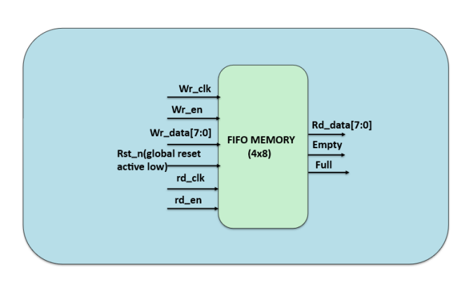
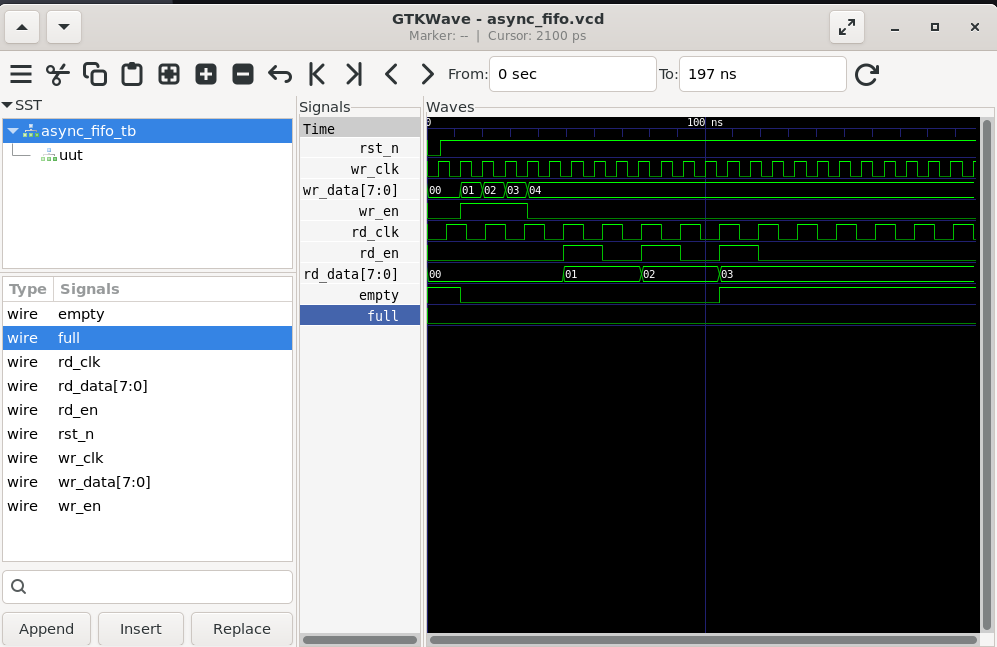

# Lab 28 – Building and Verifying a Simple Asynchronous FIFO

## Aim

To design, simulate, and verify a 4×8-bit Asynchronous FIFO using Verilog HDL for reliable data transfer between independent clock domains using Verilator and analyze the waveform using GTKWave.

---

# Theory

An **Asynchronous FIFO (First-In-First-Out)** is a memory buffer used to safely transfer data between two independent clock domains. Unlike a synchronous FIFO, the write and read operations are controlled by separate clocks, making it ideal for Clock Domain Crossing (CDC) applications.

The FIFO stores incoming data using the write clock and retrieves data using the read clock while maintaining the correct order of data transfer. To prevent overflow and underflow, **Full** and **Empty** status flags are generated based on the relationship between the write and read pointers.

In this design, the FIFO has a storage capacity of **4 words**, each **8 bits** wide. Separate write and read pointers, along with an additional wrap-around bit, are used to determine the Full and Empty conditions.

---

# Block Diagram

<p align="center">

</p>

---

# Project Structure

```text
Lab 28
│
├── Images
│   ├── block_diagram.png
│   └── waveform.png
│
├── Scripts
│   └── run.sh
│
├── Source_Code
│   └── async_fifo.v
│
├── Testbench
│   └── async_fifo_tb.v
│
├── Waveforms
│   └── async_fifo.vcd
│
└── README.md
```

---

# RTL Design

The Verilog HDL design is available in:

```text
Source_Code/async_fifo.v
```

The module implements a **4×8-bit Asynchronous FIFO** with independent write and read clock domains.

### Features

- Dual clock operation
- Independent write and read pointers
- 4-word × 8-bit FIFO memory
- Full flag generation
- Empty flag generation
- Active-low asynchronous reset
- Pointer wrap-around detection

---

# Testbench

The corresponding testbench is available in:

```text
Testbench/async_fifo_tb.v
```

The testbench performs the following operations:

- Generates independent write and read clocks.
- Applies active-low reset.
- Writes four data values into the FIFO.
- Reads the stored data using a different clock.
- Verifies FIFO operation.
- Generates the waveform for timing analysis.

---

# Simulation Procedure

## Make the Script Executable

```bash
chmod +x Scripts/run.sh
```

---

## Run the Simulation

```bash
./Scripts/run.sh
```

The script automatically performs the following tasks:

- Compiles the RTL design using Verilator.
- Builds the simulation executable.
- Executes the testbench.
- Generates the VCD waveform.
- Opens GTKWave for waveform visualization.

---

# Waveform Output

<p align="center">

</p>

### Waveform Observation

The GTKWave simulation verifies the correct operation of the asynchronous FIFO.

- **wr_clk** and **rd_clk** operate at different frequencies, demonstrating independent clock domains.
- **wr_data** is written into the FIFO whenever **wr_en** is asserted.
- **rd_data** retrieves the stored values sequentially when **rd_en** becomes active.
- **Empty** is asserted when no data is available for reading.
- **Full** becomes active when the FIFO reaches its storage capacity.
- The waveform confirms that all data written into the FIFO is read back in the correct order without corruption despite using different clock domains.

---

# Generated Waveform File

The generated VCD waveform file is available in:

```text
Waveforms/async_fifo.vcd
```

This waveform file can be opened using GTKWave for timing and functional verification.

---

# Applications

- Clock Domain Crossing (CDC)
- FPGA Design
- ASIC Design
- System-on-Chip (SoC)
- UART Communication
- SPI Communication
- High-Speed Data Transfer
- Network Interfaces
- Embedded Systems

---

# Result

The 4×8-bit Asynchronous FIFO was successfully designed using Verilog HDL, simulated using Verilator, and verified using GTKWave. The FIFO correctly transferred data between independent write and read clock domains while generating accurate Full and Empty status flags. The simulation results confirmed reliable Clock Domain Crossing (CDC) operation and correct FIFO functionality.
