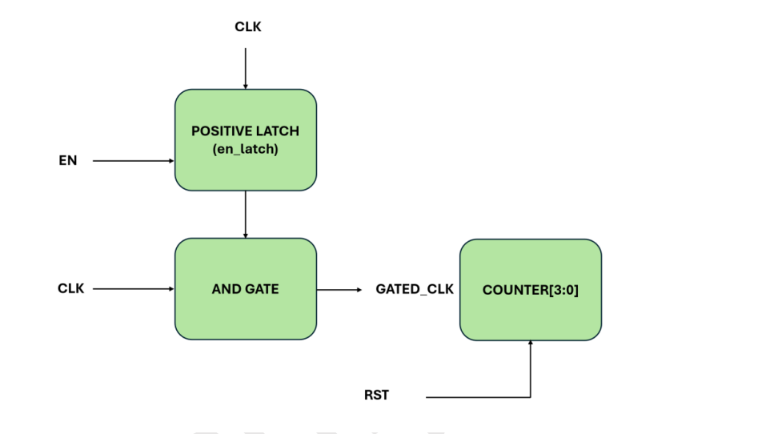
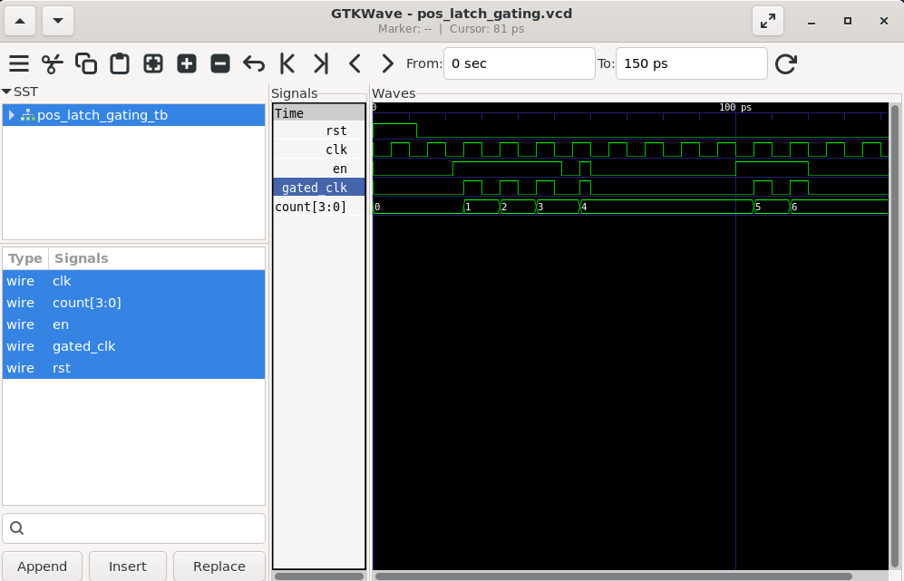
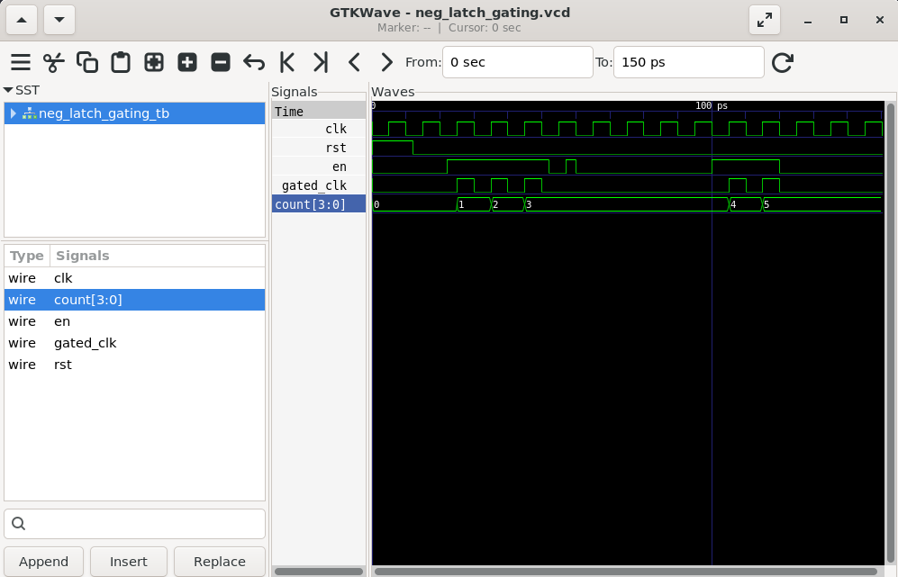
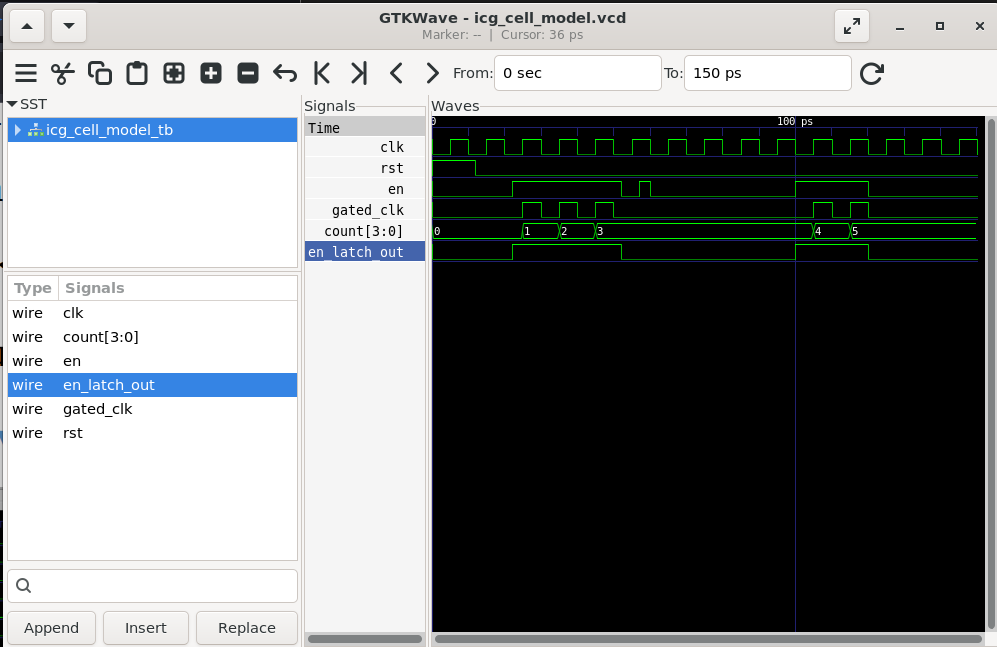

# Lab 29 – Clock Gating Techniques for Low-Power SoC Design

## Aim

To design, simulate, and compare different clock gating techniques using Verilog HDL, including Positive Latch Gating, Negative Latch Gating, and an Integrated Clock Gating (ICG) Cell Model, using Verilator and GTKWave.

---

# Theory

Clock gating is one of the most effective low-power techniques used in modern ASIC and SoC designs to reduce dynamic power consumption. Instead of allowing the clock to toggle continuously, the clock signal is enabled only when required, thereby minimizing unnecessary switching activity.

This lab demonstrates three different clock gating approaches:

- **Positive Latch Gating**
  - Samples the enable signal while the clock is HIGH.
  - Can generate glitches if the enable changes near the active clock edge.
  - Generally not recommended for practical designs.

- **Negative Latch Gating**
  - Samples the enable signal while the clock is LOW.
  - Prevents glitches by holding the enable value stable during the active clock edge.
  - Considered a safer manual clock gating technique.

- **Integrated Clock Gating (ICG) Cell**
  - Uses an internal latch and clock gating logic.
  - Industry-standard solution for glitch-free clock gating.
  - Commonly inserted automatically during synthesis for low-power ASIC designs.

---

# Block Diagram

<p align="center">

</p>

---

# Project Structure

```text
Lab 29
│
├── Images
│   ├── block_diagram.png
│   ├── pos_latch_waveform.png
│   ├── neg_latch_waveform.png
│   └── icg_waveform.png
│
├── Scripts
│   ├── pos_latch
│   │   └── run.sh
│   ├── neg_latch
│   │   └── run.sh
│   └── icg_cell
│       └── run.sh
│
├── Source_Code
│   ├── pos_latch_gating.v
│   ├── neg_latch_gating.v
│   └── icg_cell_model.v
│
├── Testbench
│   ├── pos_latch_gating_tb.v
│   ├── neg_latch_gating_tb.v
│   └── icg_cell_model_tb.v
│
├── Waveforms
│   ├── pos_latch_gating.vcd
│   ├── neg_latch_gating.vcd
│   └── icg_cell_model.vcd
│
└── README.md
```

---

# RTL Design

The Verilog HDL designs are available in:

```text
Source_Code/
```

The implementation consists of three independent clock gating techniques.

### Positive Latch Gating

- Uses a positive-level latch.
- Samples the enable signal while the clock is HIGH.
- Generates the gated clock using an AND gate.
- Demonstrates why glitches may occur during enable transitions.

---

### Negative Latch Gating

- Uses a negative-level latch.
- Samples the enable signal while the clock is LOW.
- Produces a stable gated clock.
- Eliminates runt pulses near active clock edges.

---

### Integrated Clock Gating (ICG) Cell Model

- Behavioral model of an industry-standard ICG cell.
- Captures the enable signal during the LOW phase of the clock.
- Generates a glitch-free gated clock.
- Includes internal enable latch monitoring.

---

# Testbench

The corresponding testbenches are available in:

```text
Testbench/
```

Each testbench performs the following operations:

- Generates the system clock.
- Applies reset.
- Changes the enable signal at different time instants.
- Generates gated clock pulses.
- Drives a 4-bit counter using the gated clock.
- Dumps waveform data into VCD files for GTKWave analysis.

---

# Simulation Procedure

## Make the Scripts Executable

```bash
chmod +x Scripts/pos_latch/run.sh
chmod +x Scripts/neg_latch/run.sh
chmod +x Scripts/icg_cell/run.sh
```

---

## Run the Simulations

### Positive Latch Gating

```bash
./Scripts/pos_latch/run.sh
```

---

### Negative Latch Gating

```bash
./Scripts/neg_latch/run.sh
```

---

### ICG Cell Model

```bash
./Scripts/icg_cell/run.sh
```

Each script automatically:

- Compiles the RTL using Verilator.
- Builds the simulation.
- Executes the testbench.
- Generates the corresponding VCD waveform.
- Opens GTKWave for waveform visualization.

---

# Waveform Output

## Positive Latch Gating

<p align="center">

</p>

### Observation

- The gated clock follows the enable signal while the clock is HIGH.
- Enable transitions close to the rising edge may introduce narrow clock pulses.
- Such glitches can lead to unintended counter increments.
- This illustrates why positive latch gating is generally avoided in practical ASIC designs.

---

## Negative Latch Gating

<p align="center">

</p>

### Observation

- The enable signal is sampled only while the clock is LOW.
- The gated clock remains stable during active clock edges.
- The counter increments only during valid gated clock pulses.
- Glitch-free operation is achieved through stable enable sampling.

---

## Integrated Clock Gating (ICG) Cell

<p align="center">

</p>

### Observation

- The internal enable latch captures the enable signal during the LOW clock phase.
- The generated gated clock remains completely glitch-free.
- The counter increments only when valid gated clock pulses are present.
- This waveform closely represents the behavior of standard-cell ICG implementations used in modern ASIC flows.

---

# Generated Waveform Files

The generated waveform files are available in:

```text
Waveforms/
├── pos_latch_gating.vcd
├── neg_latch_gating.vcd
└── icg_cell_model.vcd
```

These waveform files can be opened using GTKWave for timing and functional analysis.

---

# Applications

- Low-Power ASIC Design
- Clock Tree Optimization
- System-on-Chip (SoC) Design
- Power-Aware RTL Design
- Mobile Processors
- Embedded Systems
- FPGA Prototyping
- Battery-Powered Electronics

---

# Result

The Positive Latch Gating, Negative Latch Gating, and Integrated Clock Gating (ICG) Cell techniques were successfully implemented using Verilog HDL and verified using Verilator and GTKWave. The simulation results demonstrated that Positive Latch Gating is susceptible to glitches, whereas Negative Latch Gating and the ICG Cell provide stable, glitch-free gated clocks suitable for low-power digital and SoC designs.
