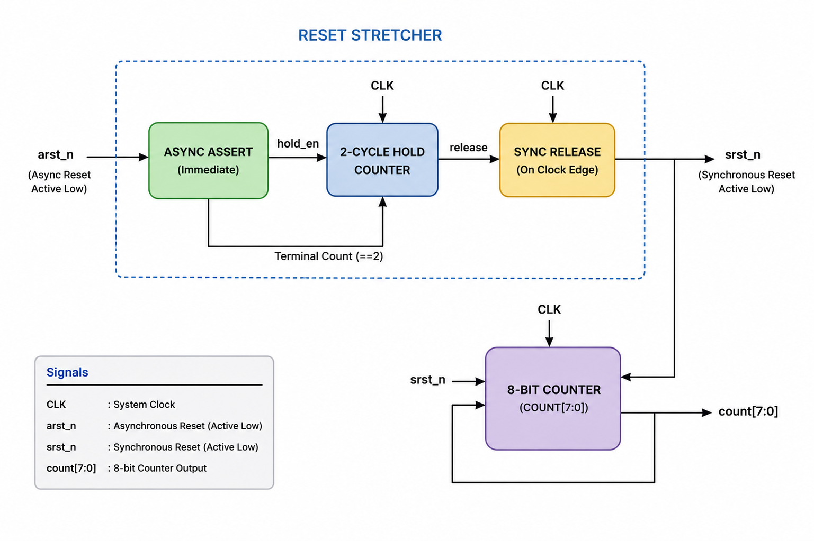
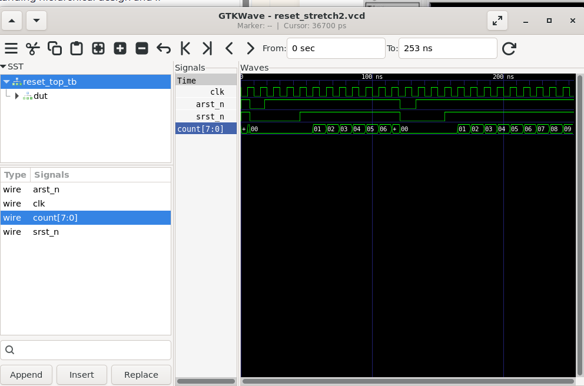

# Lab 30 – Reset Stretcher with Synchronous Release

## Aim

To design, simulate, and verify a Reset Stretcher with asynchronous reset assertion and synchronous reset release using Verilog HDL with Verilator and analyze the waveform using GTKWave.

---

# Theory

A reset circuit initializes all sequential elements in a digital system to a known state during startup or fault conditions. While an **asynchronous reset** allows immediate assertion regardless of the system clock, releasing it asynchronously may introduce metastability and inconsistent startup behavior.

A **Reset Stretcher** solves this problem by combining:

- Immediate asynchronous reset assertion.
- Synchronous reset release.
- A programmable hold period before releasing reset.

In this design, the reset is held active for **two clock cycles** after the asynchronous reset is deasserted. This ensures that all sequential logic exits reset simultaneously on a clock edge, improving reliability in FPGA and ASIC designs.

---

# Block Diagram

<p align="center">

</p>

---

# Project Structure

```text
Lab 30
│
├── Images
│   ├── block_diagram.png
│   └── waveform.png
│
├── Scripts
│   └── run.sh
│
├── Source_Code
│   ├── reset_stretch.v
│   └── reset_top.v
│
├── Testbench
│   └── reset_top_tb.v
│
├── Waveforms
│   └── reset_stretch2.vcd
│
└── README.md
```

---

# RTL Design

The Verilog HDL design files are available in:

```text
Source_Code/
```

The implementation consists of two modules.

### reset_stretch.v

- Implements asynchronous reset assertion.
- Holds reset active for two clock cycles after reset deassertion.
- Releases reset synchronously with the system clock.
- Prevents reset-related metastability.

---

### reset_top.v

- Instantiates the reset stretcher.
- Implements an 8-bit counter.
- Counter remains in reset while the synchronized reset is active.
- Counter starts incrementing only after the delayed synchronous reset release.

---

# Testbench

The corresponding testbench is available in:

```text
Testbench/reset_top_tb.v
```

The testbench performs the following operations:

- Generates a 10 ns clock.
- Applies asynchronous reset at arbitrary time instants.
- Releases reset asynchronously.
- Verifies the two-cycle reset stretching behavior.
- Dumps waveform data into a VCD file.
- Confirms proper counter operation after reset release.

---

# Simulation Procedure

## Make the Script Executable

```bash
chmod +x Scripts/run.sh
```

---

## Run the Simulation

```bash
./Scripts/run.sh
```

The script automatically performs the following tasks:

- Compiles the RTL using Verilator.
- Builds the simulation executable.
- Executes the testbench.
- Generates the VCD waveform.
- Opens GTKWave for waveform analysis.

---

# Waveform Output

<p align="center">

</p>

### Waveform Observation

The GTKWave simulation verifies the correct operation of the Reset Stretcher.

- **arst_n** is asserted asynchronously and immediately forces the system into reset.
- **srst_n** remains active for two additional clock cycles after **arst_n** is released.
- The synchronized reset is released only on a clock edge.
- The **8-bit counter** remains at zero while **srst_n** is active.
- After the synchronous reset release, the counter begins incrementing normally on each rising clock edge.
- The waveform demonstrates safe and predictable startup behavior without reset-related timing hazards.

---

# Generated Waveform File

The generated VCD waveform file is available in:

```text
Waveforms/reset_stretch2.vcd
```

This waveform file can be opened using GTKWave for timing and functional verification.

---

# Applications

- FPGA Design
- ASIC Design
- System-on-Chip (SoC)
- Processor Reset Controllers
- Embedded Systems
- Power-On Reset Circuits
- Safety-Critical Digital Systems
- Clock Domain Initialization

---

# Result

The Reset Stretcher with asynchronous assertion and synchronous release was successfully designed using Verilog HDL, simulated using Verilator, and verified using GTKWave. The simulation confirmed immediate reset assertion, a two-clock-cycle reset hold period, and synchronized reset release, ensuring reliable startup and stable operation of the digital system.
