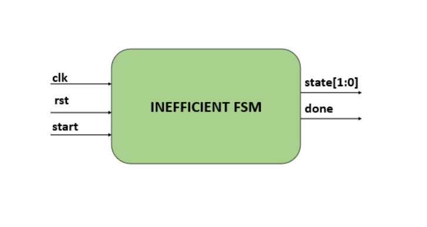
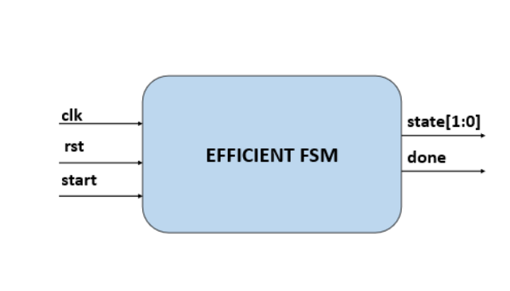
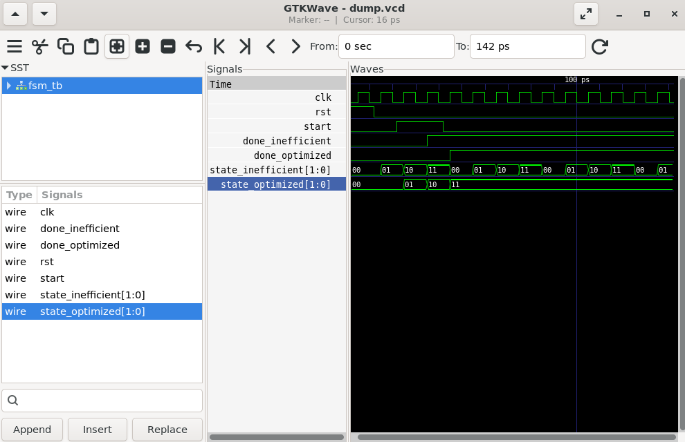

# Lab 31 – Low-Power Verilog Coding Exercises

## Aim

To design, simulate, and compare an Inefficient Finite State Machine (FSM) and an Optimized FSM using Verilog HDL with Verilator, and analyze their switching activity using GTKWave to understand the impact of RTL coding style on dynamic power consumption.

---

# Theory

Dynamic power consumption in digital circuits is primarily caused by signal switching activity. Poor RTL coding practices, such as unconditional register updates, result in unnecessary signal transitions even when the logic does not require any changes.

An optimized RTL design minimizes switching activity by updating registers and outputs only when necessary. This reduction in unnecessary toggling lowers dynamic power consumption without affecting the functionality of the design.

The relationship between dynamic power and switching activity is given by:

\[
P_{dynamic}= \alpha C V^2 f
\]

Where:

- **α** = Switching Activity
- **C** = Load Capacitance
- **V** = Supply Voltage
- **f** = Clock Frequency

Reducing switching activity directly lowers dynamic power, making efficient RTL coding an important aspect of FPGA and ASIC design.

---

# Block Diagrams

## Inefficient FSM

<p align="center">

</p>

---

## Optimized FSM

<p align="center">

</p>

---

# Project Structure

```text
Lab 31
│
├── Images
│   ├── inefficient_fsm_block.png
│   ├── optimized_fsm_block.png
│   └── waveform.png
│
├── Scripts
│   └── run.sh
│
├── Source_Code
│   ├── inefficient_fsm.v
│   └── optimized_fsm.v
│
├── Testbench
│   └── fsm_tb.v
│
├── Waveforms
│   └── dump.vcd
│
└── README.md
```

---

# RTL Design

The Verilog HDL design files are available in:

```text
Source_Code/
```

The implementation consists of two FSM modules.

### inefficient_fsm.v

- Implements a simple FSM with unconditional state updates.
- Continuously updates registers on every clock cycle.
- Generates unnecessary switching activity.
- Demonstrates poor RTL coding practice with higher dynamic power consumption.

---

### optimized_fsm.v

- Implements an optimized FSM using conditional state transitions.
- Updates registers only when required.
- Minimizes switching activity.
- Demonstrates efficient RTL coding for low-power digital design.

---

# Testbench

The corresponding testbench is available in:

```text
Testbench/fsm_tb.v
```

The testbench performs the following operations:

- Generates a 10 ns clock.
- Applies reset to initialize both FSMs.
- Generates the **start** signal.
- Simulates both FSMs using identical inputs.
- Dumps simulation data into a VCD waveform file.
- Enables comparison of switching activity using GTKWave.

---

# Simulation Procedure

## Make the Script Executable

```bash
chmod +x Scripts/run.sh
```

---

## Run the Simulation

```bash
./Scripts/run.sh
```

The script automatically performs the following tasks:

- Compiles the RTL using Verilator.
- Builds the simulation executable.
- Executes the testbench.
- Generates the VCD waveform.
- Opens GTKWave for waveform analysis.

---

# Waveform Output

<p align="center">

</p>

### Waveform Observation

The GTKWave simulation compares the behavior of the Inefficient FSM and the Optimized FSM.

- **clk** provides the system clock for both FSMs.
- **rst** initializes both FSMs to their initial state.
- **start** triggers the state transition sequence.
- **state_inefficient** transitions continuously due to unconditional state updates.
- **done_inefficient** is asserted after reaching the completion state.
- **state_optimized** changes only when required, resulting in fewer signal transitions.
- **done_optimized** is asserted after completing the optimized state sequence.
- The waveform clearly demonstrates reduced switching activity in the optimized design, indicating lower dynamic power consumption while maintaining correct functionality.

---

# Generated Waveform File

The generated VCD waveform file is available in:

```text
Waveforms/dump.vcd
```

This waveform file can be opened using GTKWave for timing and functional verification.

---

# Applications

- Low-Power FPGA Design
- ASIC Design
- System-on-Chip (SoC)
- Embedded Systems
- Battery-Powered Electronics
- IoT Devices
- Digital Controllers
- Processor Control Logic
- Communication Systems
- Power-Aware Digital Design

---

# Result

The Inefficient FSM and Optimized FSM were successfully designed using Verilog HDL, simulated using Verilator, and verified using GTKWave. The simulation demonstrated that conditional RTL coding significantly reduces unnecessary switching activity while maintaining identical functionality, highlighting an effective low-power design methodology for modern FPGA and ASIC applications.
