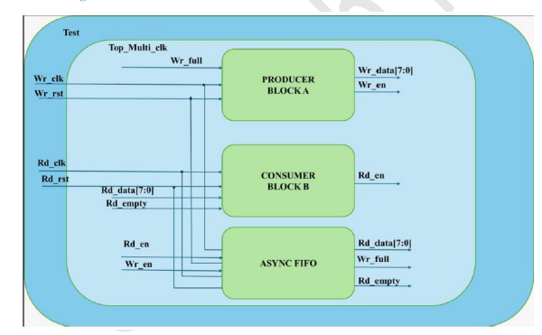
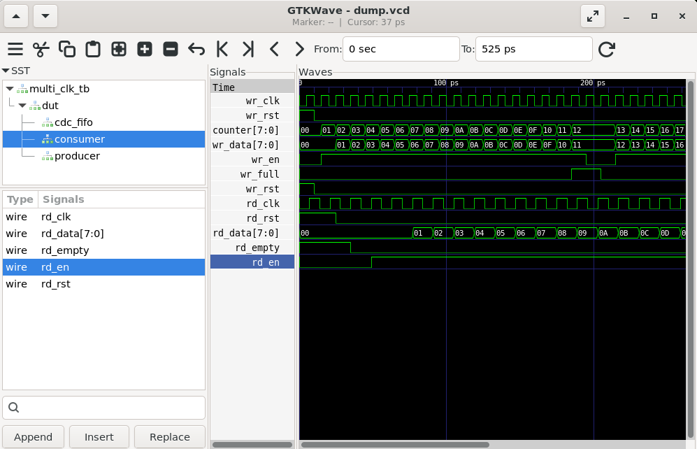

# Lab 32 – Building a Multi-Clock Domain Subsystem

## Aim

To design, simulate, and verify a Multi-Clock Domain Subsystem using Verilog HDL by integrating a Producer, Consumer, and Asynchronous FIFO for safe data transfer across independent clock domains, and analyze the operation using Verilator and GTKWave.

---

# Theory

Modern FPGA and ASIC designs often contain multiple functional blocks operating at different clock frequencies. Direct communication between independent clock domains can lead to metastability, timing violations, and data corruption.

An **Asynchronous FIFO (First-In-First-Out)** is a widely used Clock Domain Crossing (CDC) technique that enables reliable data transfer between independent write and read clock domains. Separate write and read pointers, along with **Full** and **Empty** status flags, ensure safe communication while preventing overflow and underflow conditions.

In this design:

- The **Producer** generates sequential data in the write clock domain.
- The **Asynchronous FIFO** buffers the data safely.
- The **Consumer** reads data in the read clock domain.
- Independent clocks demonstrate reliable CDC operation.

---

# Block Diagram

<p align="center">

</p>

---

# Project Structure

```text
Lab 32
│
├── Images
│   ├── block_diagram.png
│   └── waveform.png
│
├── Scripts
│   └── run.sh
│
├── Source_Code
│   ├── block_a.v
│   ├── block_b.v
│   ├── async_fifo.v
│   └── top_multi_clk.v
│
├── Testbench
│   └── multi_clk_tb.v
│
├── Waveforms
│   └── dump.vcd
│
└── README.md
```

---

# RTL Design

The Verilog HDL design files are available in:

```text
Source_Code/
```

The implementation consists of four modules.

### block_a.v

- Implements the Producer block.
- Generates incrementing 8-bit data.
- Writes data into the FIFO.
- Stops writing when the FIFO becomes full.

---

### block_b.v

- Implements the Consumer block.
- Reads data from the FIFO.
- Enables reading only when valid data is available.
- Prevents FIFO underflow.

---

### async_fifo.v

- Implements an 8-entry asynchronous FIFO.
- Supports independent write and read clock domains.
- Stores 8-bit data.
- Generates **wr_full** and **rd_empty** status flags.
- Enables safe Clock Domain Crossing (CDC).

---

### top_multi_clk.v

- Integrates the Producer, Consumer, and Asynchronous FIFO.
- Connects independent write and read clock domains.
- Demonstrates complete multi-clock subsystem operation.

---

# Testbench

The corresponding testbench is available in:

```text
Testbench/multi_clk_tb.v
```

The testbench performs the following operations:

- Generates independent write and read clocks.
- Applies reset to both clock domains.
- Instantiates the complete multi-clock subsystem.
- Simulates Producer, FIFO, and Consumer operation.
- Dumps simulation data into a VCD waveform file.
- Verifies safe data transfer across asynchronous clock domains.

---

# Simulation Procedure

## Make the Script Executable

```bash
chmod +x Scripts/run.sh
```

---

## Run the Simulation

```bash
./Scripts/run.sh
```

The script automatically performs the following tasks:

- Compiles the RTL using Verilator.
- Builds the simulation executable.
- Executes the testbench.
- Generates the VCD waveform.
- Opens GTKWave for waveform analysis.

---

# Waveform Output

<p align="center">

</p>

### Waveform Observation

The GTKWave simulation verifies the correct operation of the Multi-Clock Domain Subsystem.

- **wr_clk** and **rd_clk** operate at different frequencies, representing independent clock domains.
- **wr_data** increments sequentially in the Producer module.
- **wr_en** remains active while the FIFO has available space.
- **wr_full** prevents additional writes when the FIFO reaches capacity.
- **rd_en** becomes active whenever valid data is available for reading.
- **rd_data** matches the data previously written by the Producer after passing through the FIFO.
- **rd_empty** indicates when the FIFO contains no valid data.
- The waveform confirms reliable data transfer without corruption despite asynchronous clock operation.

---

# Generated Waveform File

The generated VCD waveform file is available in:

```text
Waveforms/dump.vcd
```

This waveform file can be opened using GTKWave for timing and functional verification.

---

# Applications

- Multi-Clock FPGA Designs
- ASIC Design
- System-on-Chip (SoC)
- Network-on-Chip (NoC)
- High-Speed Communication Interfaces
- DMA Controllers
- Processor Subsystems
- Video Processing Systems
- Embedded Systems
- Clock Domain Crossing (CDC) Designs

---

# Result

The Multi-Clock Domain Subsystem consisting of a Producer, Consumer, and Asynchronous FIFO was successfully designed using Verilog HDL, simulated using Verilator, and verified using GTKWave. The simulation confirmed reliable data transfer across independent clock domains while preventing overflow, underflow, and data corruption, demonstrating a robust Clock Domain Crossing (CDC) implementation suitable for FPGA and ASIC applications.
